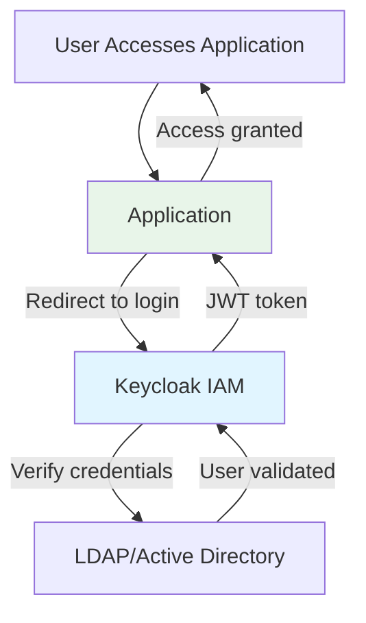

# Application Layer

The application layer consists of the end-user applications that run on the platform. These applications are the "products" that deliver value to citizens and internal users.

## Products

The platform can deploy two main products:

### EServices

**EServices** is a comprehensive e-government platform for delivering citizen-facing services.

**Components:**

- **E-Services Front Office**: Public portal for citizens
- **E-Services Front Office Interne**: Internal portal for government employees
- **E-Services Back Office**: Administrative portal for service management

**Architecture:**

- Microservices-based architecture
- Deployed on RKE2-APPS cluster
- Integrates with all middleware services

**Technology Stack:**

- Backend: Java Spring Boot microservices
- Frontend: Angular web applications
- Mobile: Native iOS/Android apps

**Key Features:**

- Service catalog for citizens
- Online applications and submissions
- Document management
- Payment integration
- Notification system (email, SMS, push notifications)
- Workflow integration (Flowable BPM)

### GCO (Gestion Courrier Opérationnel)

**GCO** is an operations management portal for internal and backoffice users.

**Purpose:** Document and correspondence management for government operations

**Deployment:** RKE2-APPS cluster

**Key Features:**

- Document tracking and routing
- Correspondence management
- Search and archiving
- Integration with external systems

---

## Application Registry

The platform maintains a centralized registry of all deployed applications and middleware services. This registry is automatically populated during architecture scaffolding.

### Infrastructure Applications

**Deployed on all platforms regardless of selected products:**

| Application | Category | Description | Primary Users |
|-------------|----------|-------------|---------------|
| **ArgoCD RKE2 LAN/DMZ** | `argocd` | GitOps continuous delivery for Kubernetes clusters | DevOps, Platform Admins |
| **Rancher Server** | `rancher` | Kubernetes cluster management console | Cluster Administrators |
| **HashiCorp Vault** | `vault` | Centralized secrets management | DevOps, Security Teams |
| **Gogs** | `gogs` | Self-hosted Git source code repository | Development Teams |
| **Docker Registry** | `registry` | Private container image registry | CI/CD Systems |
| **Coroot** | `coroot` | Monitoring and observability platform | SRE, DevOps |
| **Neuvector** | `neuvector` | Container security platform (vulnerability scanning, runtime protection, network segmentation) | SRE, DevOps, Security Teams |
| **Keycloak** | `keycloak` | Identity and access management (IAM) | All Users |
| **MinIO** | `minio` | S3-compatible object storage (primary and backup) | Administrators, Developers |
| **AKHQ** | `kafka` | Kafka cluster web UI and management | Developers |
| **n8n** | `n8n` | Workflow automation and integration platform | Business Analysts |
| **Gravitee API Gateway** | `gravitee` | API management platform (LAN and DMZ) | API Administrators |

### Product-Specific Applications

**Deployed only when corresponding product is selected:**

#### For EServices Product

| Application | Category | Description | Primary Users |
|-------------|----------|-------------|---------------|
| **Flowable BPM** | `flowable` | Business process management engine | Business Users |
| **E-Services Portal** | `ael-client-ui` | Citizen-facing web portal | Citizens, End Users |

#### For GCO Product

| Application | Category | Description | Primary Users |
|-------------|----------|-------------|---------------|
| **GCO Portal** | `gco` | Operations management portal | Internal/Backoffice Users |

---

## Application Access Endpoints

All applications are accessible through standardized HTTPS URLs following the pattern:

```
https://{prefix}{application}.{base_domain}{path_suffix}
```

Where:

- `{prefix}`: Environment identifier (e.g., `dev-`, `test-`, `qa-`, `prod-`, or empty)
- `{application}`: Application-specific identifier
- `{base_domain}`: Platform DNS domain
- `{path_suffix}`: Application-specific path (optional)

### Infrastructure Application URLs

| Application | URL Pattern | Access Via |
|-------------|-------------|------------|
| **ArgoCD RKE2 LAN** | `https://{prefix}argocd-apps.{domain}` | LBLAN |
| **ArgoCD RKE2 DMZ** | `https://{prefix}argocd-dmz.{domain}` | LBLAN |
| **Rancher Server** | `https://{prefix}rancher.{domain}` | LBLAN |
| **HashiCorp Vault** | `https://{prefix}vault.{domain}` | LBLAN |
| **Gogs Git Server** | `https://{prefix}gogs.{domain}` | LBLAN |
| **Docker Registry** | `https://{prefix}registry.{domain}/v2/_catalog` | LBLAN |
| **Coroot Monitoring** | `https://{prefix}coroot.{domain}` | LBLAN |
| **Neuvector Security Platform** | `https://{prefix}neuvector-apps.{domain}` | LBLAN |
| **Keycloak IAM** | `https://{prefix}keycloak.{domain}` | LBLAN |
| **MinIO Console** | `https://{prefix}minio-ui.{domain}` | LBLAN |
| **MinIO Backup** | `https://{prefix}minio-backup.{domain}` | LBLAN |
| **AKHQ Kafka UI** | `https://{prefix}akhq.{domain}` | LBLAN |
| **n8n Workflow** | `https://{prefix}n8n.{domain}` | LBLAN |
| **Gravitee LAN** | `https://{prefix}apim.{domain}/console/` | LBLAN |
| **Gravitee DMZ** | `https://{prefix}gravitee-dmz.{domain}/console/` | LBLAN |

### Product Application URLs

| Application | URL Pattern | Access Via |
|-------------|-------------|------------|
| **Flowable BPM** (EService) | `https://{prefix}flowable.{domain}/flowable-ui` | LBLAN |
| **E-Services Front Office** | `https://{prefix}ael-client-ui.{domain}` | LBDMZ → LBLAN |
| **E-Services Front Office Interne** | `https://{prefix}ael-client-ui-interne.{domain}` | LBLAN |
| **E-Services Back Office** | `https://{prefix}ael-back-ui.{domain}` | LBLAN |
| **GCO Portal** (GCO) | `https://{prefix}gco.{domain}/GCOWEB` | LBLAN |

---

## Access Control

Applications have different access requirements based on their purpose:

### Administrative Access

**Applications:** Rancher, Vault, ArgoCD, MinIO Backup, Coroot, Docker Registry, Gogs, Neuvector

**Users:** DevOps teams, platform administrators, SRE

**Access Pattern:**

- Internal network only (via LBLAN)
- Requires administrative credentials
- Often integrated with Keycloak SSO

### Developer Access

**Applications:** Gogs, Docker Registry, AKHQ, MinIO

**Users:** Development teams, DevOps

**Access Pattern:**

- Internal network only
- Authenticated access via Keycloak or application-specific credentials
- API access available for automation

### Business User Access

**Applications:** Flowable, n8n

**Users:** Business analysts, process managers

**Access Pattern:**

- Internal network
- Keycloak SSO authentication
- Role-based access control (RBAC)

### Citizen/End-User Access

**Applications:** E-Services Front Office, GCO Portal

**Users:** Citizens, end users, government employees

**Access Pattern:**

- External access via LBDMZ (for public portals)
- Internal access via LBLAN (for internal portals)
- Keycloak SSO or custom authentication
- Public registration allowed (for citizen portals)

---

## Single Sign-On (SSO) Integration

Most applications integrate with **Keycloak** for unified authentication:



**Benefits:**

- Single set of credentials for all applications
- Centralized user management
- Multi-factor authentication (MFA) support
- Session management and single logout
- Integration with enterprise LDAP/Active Directory

**Integrated Applications:**

- eServices (Front Office, Back Office, Interne)
- GCO Portal
- Flowable BPM
- MinIO Console
- AKHQ (Kafka UI)
- n8n
- Rancher
- Argo CD
- Gravitee API Management

---

## URL Construction Examples

### Example 1: Development Environment

**Configuration:**

- `env_prefix`: `dev-`
- `base_domain`: `example.com`

**Generated URLs:**

- Rancher: `https://dev-rancher.example.com`
- Keycloak: `https://dev-keycloak.example.com`
- E-Services: `https://dev-ael-client-ui.example.com`
- Gravitee LAN: `https://dev-apim.example.com/console/`

### Example 2: Production Environment

**Configuration:**

- `env_prefix`: `` (empty)
- `base_domain`: `government.ma`

**Generated URLs:**

- Rancher: `https://rancher.government.ma`
- Keycloak: `https://keycloak.government.ma`
- E-Services: `https://ael-client-ui.government.ma`
- Gravitee LAN: `https://apim.government.ma/console/`

---

!!! success "Comprehensive Application Ecosystem"
    The platform provides a complete suite of infrastructure, middleware, and application services accessible through a unified, secure, and standardized URL structure.

!!! info "Next Steps"
    Learn about [External Services](external-services.md) that integrate with these applications.
