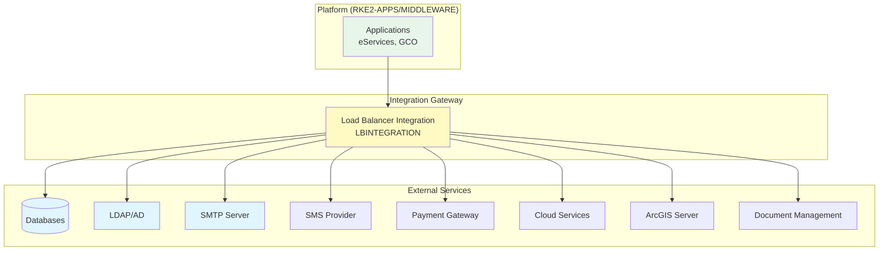
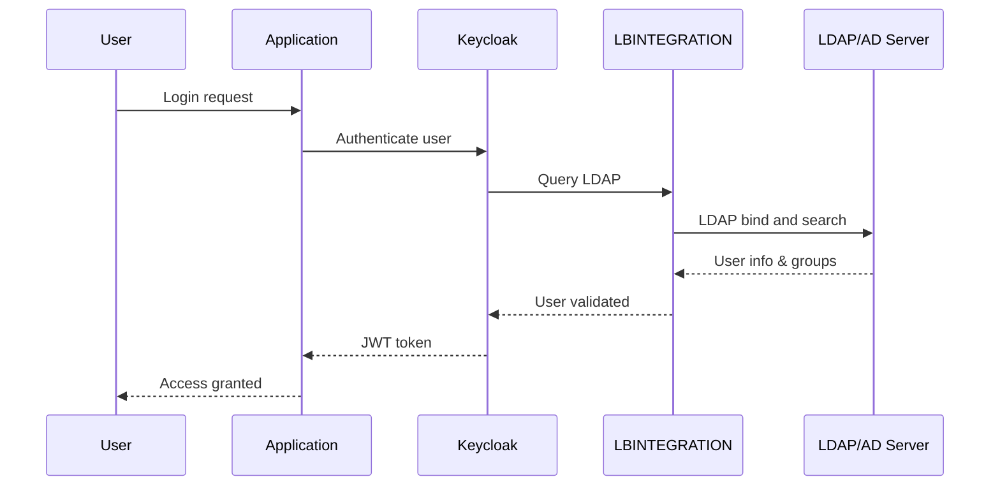

# External Service Integrations

The platform is designed to integrate with various external services to provide complete business functionality. These integrations are configured via the API and connect through the **LBINTEGRATION** load balancer for centralized security management.

## Integration Architecture



**Security Benefits:**

- All external connections funnel through LBINTEGRATION
- Simplified firewall rules (single egress point)
- Centralized logging and monitoring of external communications
- Network isolation between platform and external services

---

## Database Services

### PostgreSQL

**Purpose:** Primary relational database for application data

**Use Cases:**

- User account data
- Transaction records
- Application configuration
- Audit logs

**Connection Pattern:**

```
Application → LBINTEGRATION → PostgreSQL Server
```

**Configuration:**

- Host, port, database name
- Credentials stored in HashiCorp Vault
- Connection pooling for performance
- SSL/TLS encryption

### Informix

**Purpose:** Legacy database integration

**Use Cases:**

- Integration with existing government systems
- Legacy data access
- Data migration and synchronization

**Connection Pattern:**

```
Application → LBINTEGRATION → Informix Server
```

**Configuration:**

- JDBC connection strings
- Credentials stored in Vault
- Informix Client SDK integrated in application containers

---

## Directory Services

### LDAP / Active Directory

**Purpose:** Enterprise user authentication and authorization

**Use Cases:**

- Employee authentication for internal portals
- User provisioning and synchronization
- Group membership for role-based access
- Integration with existing enterprise directory

**Integration Flow:**



**Configuration:**

- LDAP server URL and port (389 for LDAP, 636 for LDAPS)
- Base DN for user searches
- Bind credentials (stored in Vault)
- User and group attribute mappings
- Configured in Keycloak for SSO

---

## Cloud and SaaS Services

### Google Services

#### reCAPTCHA

**Purpose:** Bot protection for public forms

**Use Cases:**

- Registration forms
- Contact forms
- Public service requests

**Configuration:**

- Site key and secret key
- Configured per application

#### Google OAuth

**Purpose:** Social login integration

**Use Cases:**

- Citizen login with Google account
- Simplified registration

**Configuration:**

- OAuth 2.0 client ID and secret
- Redirect URIs configured in Keycloak

### Facebook OAuth

**Purpose:** Social login integration

**Use Cases:**

- Alternative citizen authentication
- Simplified registration

**Configuration:**

- Facebook App ID and secret
- OAuth integration via Keycloak

### Firebase Cloud Messaging (FCM)

**Purpose:** Push notifications for mobile applications

**Use Cases:**

- Real-time notifications to mobile apps
- Service status updates
- Document ready alerts
- Appointment reminders

**Integration:**

- FCM server key configured in backend
- Mobile apps register device tokens
- Backend sends notifications via FCM API

**Connection Pattern:**

```
Backend Service → LBINTEGRATION → Firebase API
```

### Firebase Realtime Database

**Purpose:** Real-time data synchronization for mobile apps

**Use Cases:**

- Real-time status updates
- Chat/messaging features
- Collaborative features

**Configuration:**

- Firebase project credentials
- Database rules and security
- SDK integration in mobile apps

---

## Payment and Publishing

### Payment Providers

**Purpose:** Online payment processing for government services

**Use Cases:**

- Service fee payments
- Fine payments
- License renewal fees

**Supported Providers:**

- Credit/debit card processors
- Local payment gateways
- Mobile money providers

**Integration:**

- REST API integration
- Webhook callbacks for payment status
- Credentials stored in Vault

**Connection Pattern:**

```
Application → LBINTEGRATION → Payment Gateway API
```

### Publishing Providers

**Purpose:** Document publishing and delivery

**Use Cases:**

- Official document generation
- Certificate printing
- Document delivery services

**Integration:**

- API integration for document submission
- Status tracking
- Delivery confirmation

---

## Communication Services

### SMTP Servers

**Purpose:** Email delivery for application notifications

**Use Cases:**

- User registration confirmations
- Password reset emails
- Service request notifications
- Status update emails
- Scheduled reports

**Configuration:**

- SMTP server host and port (25, 587, 465)
- Authentication credentials (stored in Vault)
- TLS/SSL encryption
- Sender address and display name

**Connection Pattern:**

```
Application → LBINTEGRATION → SMTP Server
```

### SMS Providers

**Purpose:** SMS notifications and alerts

**Use Cases:**

- OTP (One-Time Password) for 2FA
- Appointment reminders
- Application status updates
- Emergency alerts

**Supported Integration Methods:**

- REST API
- SMPP protocol
- HTTP GET/POST gateways

**Configuration:**

- Provider API endpoint
- API key/credentials (stored in Vault)
- Sender ID configuration

---

## Geographic Information Systems (GIS)

### ArcGIS Server

**Purpose:** Geospatial data and mapping services

**Use Cases:**

- Interactive maps in citizen portals
- Location-based service requests
- Property boundary visualization
- Urban planning data

**Integration:**

- ArcGIS REST API
- Map services and feature layers
- Geocoding and reverse geocoding
- Spatial queries

**Connection Pattern:**

```
Application → LBINTEGRATION → ArcGIS Server
```

**Configuration:**

- ArcGIS Server URL
- Authentication tokens (if required)
- Layer and service IDs

---

## Document Management

### Alfresco

**Purpose:** Enterprise document management system integration

**Use Cases:**

- Long-term document archival
- Document versioning
- Compliance and retention policies
- Advanced search and metadata

**Integration:**

- Alfresco REST API
- CMIS (Content Management Interoperability Services) standard
- WebDAV for file access

**Connection Pattern:**

```
Application → LBINTEGRATION → Alfresco Server
```

**Features:**

- Document upload and download
- Version control
- Workflow integration
- Full-text search
- Metadata management

---

## Integration Configuration

All external service configurations are managed through:

1. **API Configuration**: Settings stored in the platform database
2. **Secret Management**: Credentials stored in HashiCorp Vault
3. **Connection Routing**: All traffic flows through LBINTEGRATION
4. **Monitoring**: Connection health monitored by Coroot
5. **Logging**: All integration activity logged for audit

### Configuration Pattern

```python
# Example configuration structure
{
    "service_type": "smtp",
    "name": "Primary SMTP Server",
    "host": "smtp.example.com",
    "port": 587,
    "encryption": "STARTTLS",
    "vault_path": "secret/smtp/primary",  # Credentials in Vault
    "enabled": true
}
```

---

## Network Security

### Firewall Rules

The LBINTEGRATION load balancer simplifies firewall configuration:

**Outbound Rules (from LBINTEGRATION to External Services):**

| Service | Destination Port | Protocol | Encrypted |
|---------|-----------------|----------|-----------|
| PostgreSQL | 5432 | TCP | SSL/TLS |
| Informix | 9088 | TCP | Yes |
| LDAP | 389 | TCP | No |
| LDAPS | 636 | TCP | SSL/TLS |
| SMTP | 25/587/465 | TCP | STARTTLS/SSL |
| HTTPS APIs | 443 | TCP | TLS |
| ArcGIS | 443/6443 | TCP | TLS |

**Inbound Rules:** None (LBINTEGRATION is outbound-only)

### Connection Pooling

For performance and resource management:

- Database connections pooled and reused
- Configurable pool sizes per service
- Idle connection timeout
- Health checks for connection validation

---

!!! tip "Adding New Integrations"
    New external service integrations can be added via the platform API without requiring architectural changes. Simply configure the service endpoint, store credentials in Vault, and traffic will automatically route through LBINTEGRATION.

!!! info "Next Steps"
    Understand how these services interact with platform components in [Dependencies & Communication](../dependencies.md).
