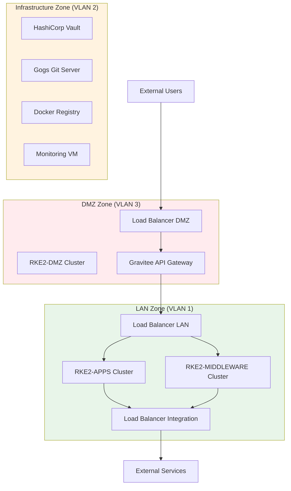
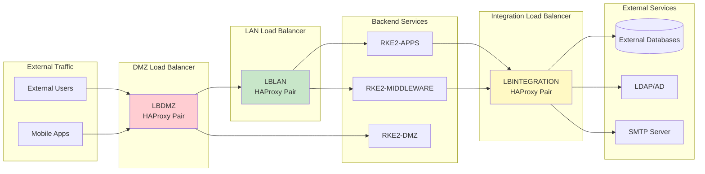

# Infrastructure Layer

The infrastructure layer provides the foundational compute, network, and storage resources for the entire platform.

## Hypervisor Platform

The platform is deployed on one of two enterprise hypervisor solutions:

=== "VMware vSphere/ESXi"
    - Industry-standard virtualization platform
    - Advanced features: vMotion, DRS, HA
    - Integrated with VMware ecosystem
    - Automated provisioning via Ansible

=== "Nutanix AHV"
    - Hyperconverged infrastructure
    - Built-in storage and networking
    - Simplified management
    - Automated provisioning via Ansible

The choice of hypervisor is configured during platform setup and both are fully supported.

---

## Virtual Machines

Linux-based virtual machines are provisioned for different roles across the platform.

### VM Categories

| VM Category | Purpose | Count | Scaling |
|-------------|---------|-------|---------|
| **Kubernetes Masters** | Control plane for RKE2 clusters | 3 per cluster | Fixed (RKE2 requirement) |
| **Kubernetes Workers** | Application and middleware workloads | Variable | Scales with user count |
| **Load Balancers** | Traffic routing and distribution | 2 per LB type | Fixed (HA pair) |
| **Infrastructure Services** | Core services (Vault, Gogs, Monitoring) | 1 per service | Fixed |

### VM Naming Convention

VM hostnames follow a consistent pattern: `{env_prefix}-{vm_type}{node_number}`

**Examples:**

- Without prefix: `rkeapp-master1`, `lblan1`, `gitops`
- With prefix (`dev-`): `dev-rkeapp-master1`, `dev-lblan1`, `dev-gitops`

The `env_prefix` allows environment separation (e.g., "dev", "test", "qa", "prod").

---

## Networking

The platform implements a multi-zone network architecture for security and traffic isolation.

### VLANs and Network Zones

### Zone Specifications

Each network zone has dedicated networking configuration:

| Zone | VLAN | Purpose | Key Components |
|------|------|---------|----------------|
| **LAN** | VLAN 1 | Application and middleware hosting | RKE2-APPS, RKE2-MIDDLEWARE, LBLAN, LBINTEGRATION |
| **INFRA** | VLAN 2 | Core infrastructure services | Vault, Gogs, Docker Registry, Monitoring |
| **DMZ** | VLAN 3 | External-facing services | RKE2-DMZ, Gravitee DMZ, LBDMZ |

Each zone includes:

- **Subnet**: Dedicated IP address range
- **Gateway**: Network gateway for routing
- **DNS Servers**: Zone-specific DNS configuration
- **Firewall Rules**: Strict access controls between zones

### DNS Management

The platform manages internal DNS records for all deployed services:

- Hostname resolution for all VMs
- Service-specific DNS entries (e.g., `vault.domain`, `gogs.domain`)
- Load balancer virtual IPs mapped to service names
- Automated DNS updates during provisioning

---

## Load Balancers

Three **HAProxy** load balancers manage traffic routing across the platform.

### Load Balancer Architecture

### 1. LBLAN (LAN Load Balancer)

**Role:** Central hub for all internal "east-west" traffic

**Traffic Handled:**

- User access to applications (eServices, GCO) → RKE2-APPS cluster
- Middleware UI/API access (Keycloak, MinIO, n8n, Flowable) → RKE2-MIDDLEWARE
- Administrative dashboards (Rancher, Coroot, Gogs, Vault)
- Kafka messaging traffic (bootstrap + broker connections)
- ArgoCD → Gogs (GitOps traffic)
- Docker Registry access
- Traffic from LBDMZ → internal services

**Deployment:** 2 VMs in active-passive HA configuration

### 2. LBDMZ (DMZ Load Balancer)

**Role:** Entry point for all external "north-south" traffic

**Intelligent Routing:**

- **Static Content**: `LBDMZ` → `LBLAN` → `RKE2-APPS` (HTML, JS, images, CSS)
- **API Calls**: `LBDMZ` → `RKE2-DMZ` (Gravitee DMZ) → `LBLAN` → Backend APIs
- **Mobile Kafka**: `LBDMZ` → `LBLAN` → `RKE2-MIDDLEWARE` (ports 32100, 31400-31402)

**Deployment:** 2 VMs in the DMZ zone in active-passive HA configuration

### 3. LBINTEGRATION (Integration Load Balancer)

**Role:** Secure gateway for platform-to-external communication

**Traffic Handled:**

- External database connections (PostgreSQL, Informix)
- LDAP/Active Directory integration
- SMTP server for email
- External service providers (SMS, Payment gateways)
- External applications (ArcGIS, Alfresco, GMAO)

**Deployment:** 2 VMs in active-passive HA configuration

**Security Benefit:** Centralizes all outbound connections, simplifying firewall rules and improving auditability.

---

## High Availability Configuration

All critical infrastructure components are deployed with high availability:

| Component | HA Strategy | Node Count |
|-----------|-------------|------------|
| **Kubernetes Masters** | Multi-master etcd cluster | 3 per cluster |
| **Load Balancers** | Active-passive HAProxy pair | 2 per LB type |
| **Kubernetes Workers** | Horizontal pod scaling | Multiple nodes |
| **Storage (Longhorn)** | 3-replica distributed storage | 3 CNS nodes per cluster |

This ensures the platform remains operational even if individual nodes fail.

---

!!! tip "Next Steps"
    Explore the [Middleware Layer](middleware.md) to learn about the services running on this infrastructure.
