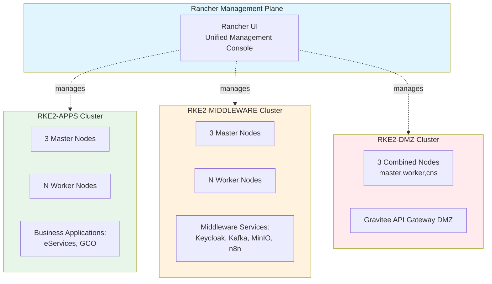
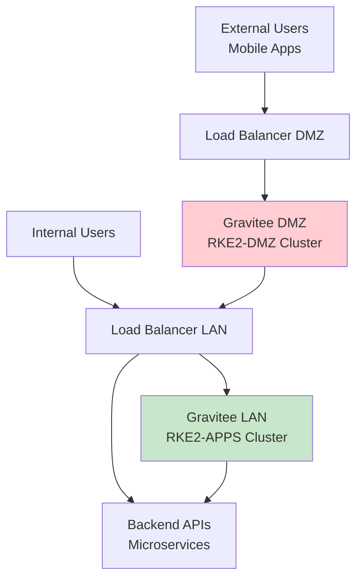

# Middleware Layer

The middleware layer provides the core services required for applications to run. Most components are deployed on the Kubernetes clusters.

## Container Orchestration

### Rancher Kubernetes Engine 2 (RKE2)

**RKE2** is a certified Kubernetes distribution that powers the platform's container orchestration.

#### Three Kubernetes Clusters

| Cluster | Purpose | Managed By | Applications |
|---------|---------|------------|--------------|
| **RKE2-APPS** | Business applications | Rancher | eServices, GCO |
| **RKE2-MIDDLEWARE** | Middleware services | Rancher | Keycloak, Kafka, MinIO, n8n, Flowable, AKHQ |
| **RKE2-DMZ** | External API gateway | Rancher | Gravitee DMZ |

**Benefits of Separation:**

- **Resource Isolation**: Applications and middleware don't compete for resources
- **Security Boundaries**: DMZ cluster is fully isolated from internal services
- **Independent Scaling**: Each cluster scales based on its specific workload
- **Fault Isolation**: Issues in one cluster don't affect others

### Rancher

**Rancher** provides a unified management plane for all three Kubernetes clusters.

**Features:**

- Single pane of glass for cluster operations
- Multi-cluster monitoring and alerting
- Centralized RBAC and authentication
- Application catalog management
- Cluster backup and disaster recovery

**Deployment:** Rancher Server runs on the MONITORING VM

**Access:** `https://{prefix}rancher.{domain}` (via LBLAN)

---

## Storage

### Longhorn

**Longhorn** is a distributed block storage system for Kubernetes.

**Key Features:**

- **Distributed Replication**: 3 replicas per volume for high availability
- **Snapshot & Backup**: Point-in-time volume snapshots
- **Volume Cloning**: Fast cloning for dev/test environments
- **Disaster Recovery**: Automated backups to MinIO

**Deployment:**

- **RKE2-APPS**: 3 CNS (Container Native Storage) nodes
- **RKE2-MIDDLEWARE**: 3 CNS nodes

**Backup Strategy:** Longhorn sends periodic backups to MinIO Backup instance on the MONITORING VM.

### MinIO

**MinIO** is an S3-compatible object storage service.

**Deployment:**

- **Primary MinIO**: RKE2-MIDDLEWARE cluster for application data
- **MinIO Backup**: Dedicated instance on MONITORING VM for Longhorn backups

**Use Cases:**

- Application file storage
- Document uploads
- Media assets
- Longhorn volume backups
- Application backups

**Access:**

- MinIO UI: `https://{prefix}minio-ui.{domain}`
- MinIO Backup: `https://{prefix}minio-backup.{domain}`

---

## Security

### HashiCorp Vault

**Vault** provides centralized secrets management for the entire platform.

**Secrets Stored:**

- Database credentials
- API keys and tokens
- TLS certificates
- SSH keys
- OAuth client secrets
- Encryption keys

**Integration:**

- **Vault Injector**: Automatically injects secrets into Kubernetes pods
- **Direct API Access**: Applications retrieve secrets programmatically

**Deployment:** Dedicated VAULT VM (outside Kubernetes for bootstrapping)

**Access:** `https://{prefix}vault.{domain}` (via LBLAN)

### Vault Injector

The **Vault Injector** is deployed on all Kubernetes clusters to automatically inject secrets from Vault into pod containers.

**Benefits:**

- No secrets stored in container images
- No secrets in environment variables or config files
- Automatic secret rotation
- Audit trail of secret access

### Cert-manager

**Cert-manager** automates TLS certificate management within Kubernetes.

**Features:**

- Automatic certificate issuance
- Certificate renewal before expiry
- Support for Let's Encrypt, self-signed, and custom CA
- Kubernetes-native certificate resources

**Deployment:** All RKE2 clusters

### Neuvector

**Neuvector** is a container security platform providing runtime protection.

**Security Features:**

- **Vulnerability Scanning**: Scan container images for CVEs
- **Runtime Protection**: Detect and block malicious behavior
- **Network Segmentation**: Micro-segmentation for zero-trust networking
- **Compliance Reporting**: CIS benchmarks and compliance checks

**Deployment:** All RKE2 clusters (APPS, MIDDLEWARE, DMZ)

### Keycloak

**Keycloak** is an identity and access management (IAM) solution.

**Features:**

- **Single Sign-On (SSO)**: Unified authentication across all applications
- **Identity Federation**: LDAP/Active Directory integration
- **OAuth 2.0 / OIDC**: Modern authentication protocols
- **User Management**: Centralized user administration
- **Multi-Factor Authentication**: Enhanced security

**Integration:**

- eServices applications
- GCO portal
- Middleware consoles (MinIO, Kafka, n8n)
- Administrative tools (Rancher, Argo CD)

**Deployment:** RKE2-MIDDLEWARE cluster

**Access:** `https://{prefix}keycloak.{domain}` (via LBLAN)

---

## Messaging and Integration

### Apache Kafka

**Kafka** is a distributed streaming platform for building real-time data pipelines.

**Use Cases:**

- Event-driven microservices communication
- Real-time notifications (mobile push via Firebase)
- Audit logging and event sourcing
- Data integration between services

**Architecture:**

- 3-node Kafka cluster for high availability
- ZooKeeper ensemble for coordination
- NodePort services for external access (ports 32100, 31400-31402)

**Deployment:** RKE2-MIDDLEWARE cluster

**Management UI (AKHQ):** `https://{prefix}akhq.{domain}`

**Mobile App Access:** Traffic flows through `LBDMZ` → `LBLAN` → Kafka brokers

### n8n

**n8n** is a workflow automation tool for connecting services.

**Capabilities:**

- Visual workflow designer
- 200+ pre-built integrations
- Custom JavaScript/Python code execution
- Webhook triggers
- Scheduled workflow execution

**Use Cases:**

- Data synchronization between systems
- Automated notifications
- Business process automation
- API orchestration

**Deployment:** RKE2-MIDDLEWARE cluster

**Access:** `https://{prefix}n8n.{domain}` (via LBLAN)

---

## API Management

### Gravitee API Management Platform

**Gravitee** provides comprehensive API management capabilities.

#### Two Gravitee Instances

| Instance | Location | Purpose | Access |
|----------|----------|---------|--------|
| **Gravitee LAN** | RKE2-APPS cluster | Manage internal API traffic | Internal users via LBLAN |
| **Gravitee DMZ** | RKE2-DMZ cluster | Secure external API traffic | External users via LBDMZ |

**Features:**

- API gateway with rate limiting
- API catalog and documentation
- Authentication and authorization (OAuth 2.0, API keys)
- Request/response transformation
- Analytics and monitoring
- Developer portal

**Traffic Flow for External APIs:**

1. External user/mobile app calls API
2. Request hits LBDMZ (DMZ Load Balancer)
3. Routed to Gravitee DMZ (RKE2-DMZ cluster)
4. Gravitee applies security policies and rate limiting
5. Proxies request to LBLAN (LAN Load Balancer)
6. Routed to backend API on RKE2-APPS or RKE2-MIDDLEWARE

**Access:**

- Gravitee LAN Console: `https://{prefix}apim.{domain}/console/`
- Gravitee DMZ Console: `https://{prefix}gravitee-dmz.{domain}/console/`

---

## CI/CD and GitOps

### Gogs

**Gogs** is a self-hosted Git service for source code management.

**Purpose:**

- Source of truth for GitOps workflow
- Stores Kubernetes manifests
- Application configuration files
- Infrastructure as Code (IaC) definitions

**Integration:**

- Argo CD pulls from Gogs to deploy applications
- Development teams push code to Gogs
- CI/CD pipelines triggered from Gogs webhooks

**Deployment:** GITOPS VM (outside Kubernetes for bootstrapping)

**Access:** `https://{prefix}gogs.{domain}` (via LBLAN)

### Argo CD

**Argo CD** is a declarative, GitOps continuous delivery tool for Kubernetes.

**How It Works:**

1. Kubernetes manifests stored in Gogs Git repository
2. Argo CD monitors Git for changes
3. Automatically syncs cluster state with Git
4. Ensures desired state matches actual state

**Benefits:**

- **Declarative Configuration**: All infrastructure defined as code
- **Automated Deployments**: Changes in Git automatically deployed
- **Rollback Capability**: Easy rollback to previous Git commits
- **Audit Trail**: Full history of all changes in Git

**Deployment:**

- **Argo CD RKE2 LAN**: Manages RKE2-APPS and RKE2-MIDDLEWARE clusters
- **Argo CD RKE2 DMZ**: Manages RKE2-DMZ cluster

**Access:**

- Argo CD LAN: `https://{prefix}argocd-apps.{domain}`
- Argo CD DMZ: `https://{prefix}argocd-dmz.{domain}`

---

## Container Registry

### Docker Registry

A private **Docker Registry** stores and distributes container images.

**Images Stored:**

- Application images (eServices, GCO)
- Middleware images (customized versions)
- Base images for Kubernetes
- CI/CD pipeline artifacts

**Security:**

- Only accessible via LBLAN (internal network)
- TLS encryption
- Authentication required for push operations

**Deployment:** GITOPS VM

**Access:** `https://{prefix}registry.{domain}/v2/_catalog` (via LBLAN)

---

## Monitoring and Logging

### Coroot

**Coroot** is a monitoring and observability platform providing insights into platform health and performance.

**Deployment Architecture:**

- **Coroot Server**: MONITORING VM
- **Coroot Agents**: Deployed on:
    - All Kubernetes clusters (RKE2-APPS, RKE2-MIDDLEWARE, RKE2-DMZ)
    - All load balancer VMs (LBLAN, LBDMZ, LBINTEGRATION)

**Metrics Collected:**

- CPU, memory, disk usage
- Network traffic and latency
- Kubernetes resource utilization
- Application performance metrics
- Container metrics

**Features:**

- Real-time dashboards
- Alerting and notifications
- Distributed tracing
- Log aggregation
- Service dependency mapping

**Access:** `https://{prefix}coroot.{domain}` (via LBLAN)

---

## Business Process Management

### Flowable

**Flowable** is a business process management (BPM) engine.

**Deployment:** RKE2-MIDDLEWARE cluster (only when **eServices** product is selected)

**Features:**

- BPMN 2.0 process modeling
- Workflow execution engine
- Form designer
- Case management
- Decision tables (DMN)

**Use Cases:**

- E-government service workflows
- Approval processes
- Document routing
- SLA management

**Access:** `https://{prefix}flowable.{domain}/flowable-ui` (via LBLAN)

---

!!! info "Service Interdependencies"
    These middleware services are highly interconnected. See [Dependencies & Communication](../dependencies.md) for detailed service interaction flows.

!!! tip "Next Steps"
    Explore the [Application Layer](applications.md) to learn about the end-user applications running on this middleware.
