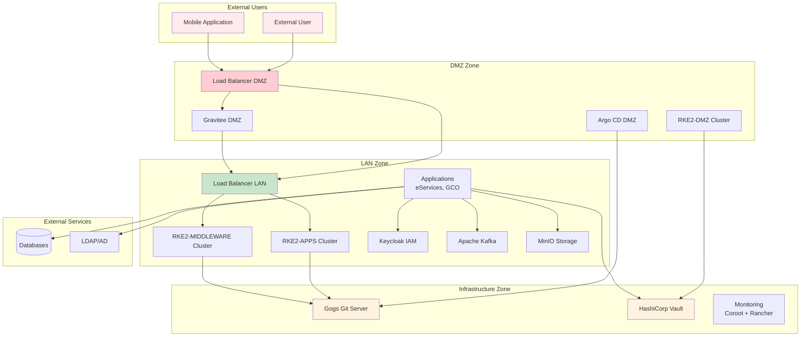
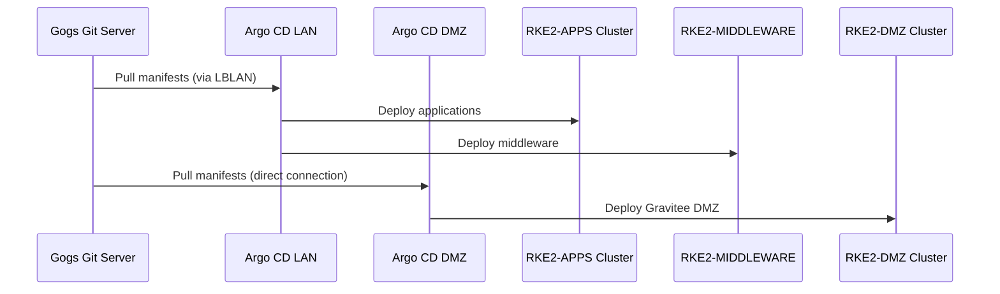
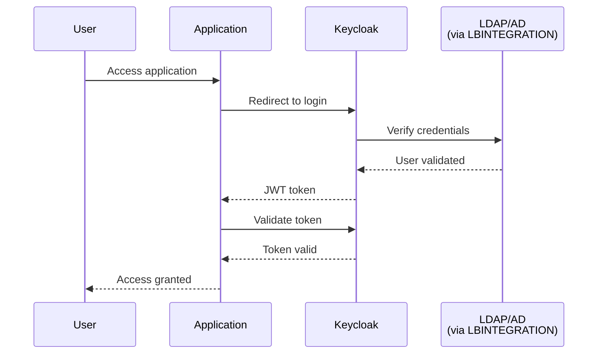
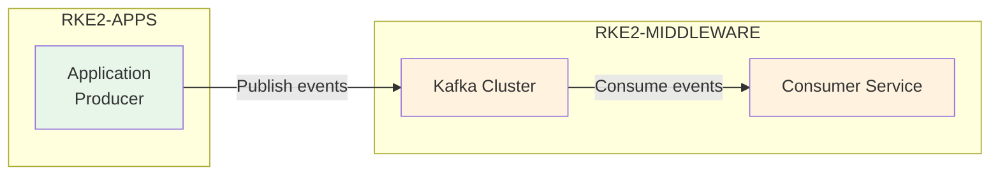
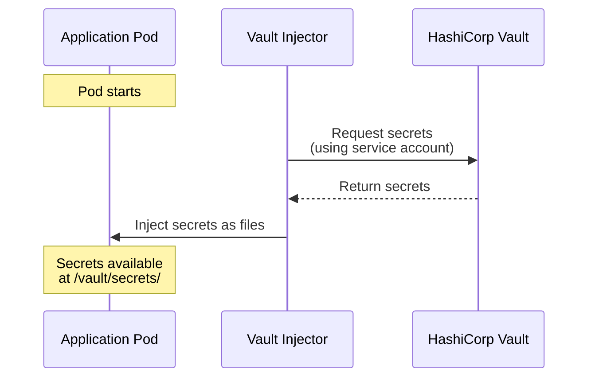
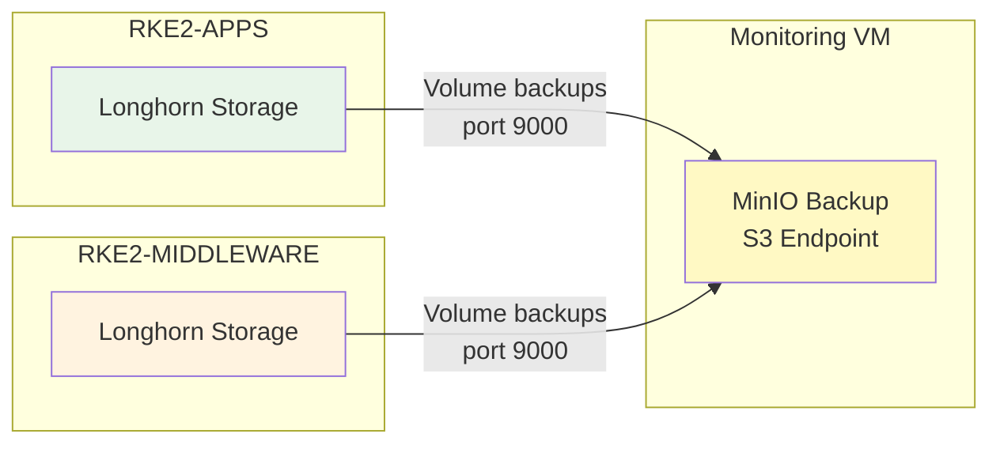
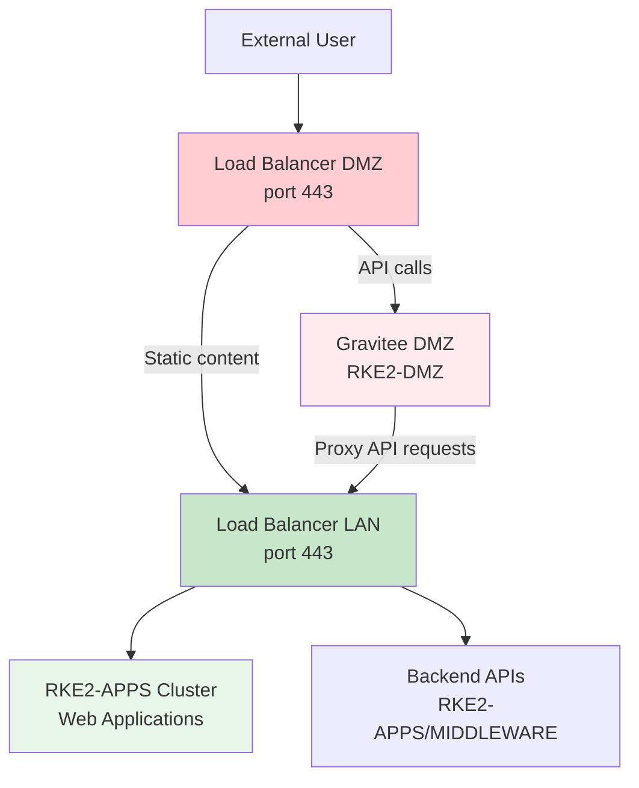
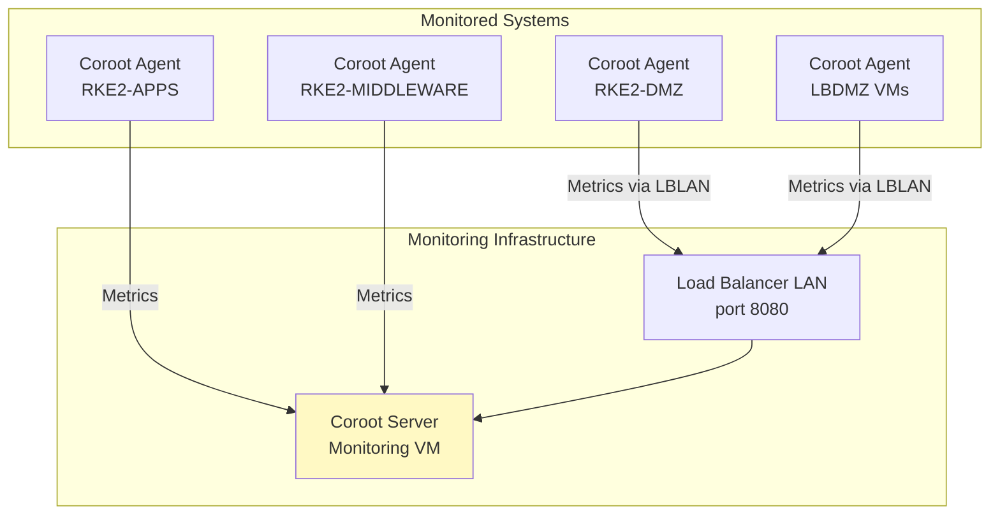
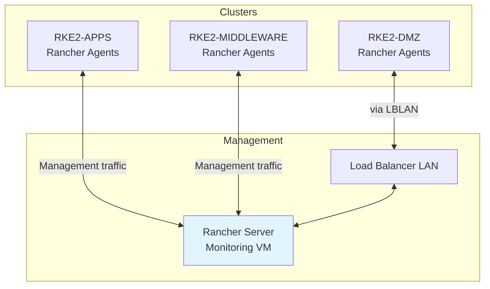

# Dependencies and Communication Flow

The components of the platform are highly interconnected. This document provides an overview of the key dependencies and communication flows between services.

## Component Dependency Graph



---

## Core GitOps Workflow

### Argo CD → Gogs

**Description:** Core of the GitOps workflow

**Communication Flow:**



**Key Points:**

- Argo CD continuously monitors Git repositories
- Automatically syncs cluster state with Git
- Manages all Kubernetes deployments
- Separate Argo CD instances for LAN and DMZ clusters

**Network Path:**

- **Argo CD LAN → Gogs**: Via LBLAN (port 443)
- **Argo CD DMZ → Gogs**: Direct connection (port 443)

---

## Authentication and Authorization

### Applications → Keycloak

**Description:** Applications delegate authentication to Keycloak

**Communication Flow:**



**Integrated Applications:**

- eServices (Front Office, Back Office, Interne)
- GCO Portal
- Flowable BPM
- MinIO Console
- AKHQ (Kafka UI)
- n8n
- Rancher
- Argo CD
- Gravitee API Management

**Network Path:** Applications → Keycloak via internal cluster DNS (RKE2-MIDDLEWARE cluster)

---

## Messaging and Events

### Applications → Kafka

**Description:** Applications use Kafka for asynchronous messaging

**Use Cases:**

- Event-driven microservices
- Real-time notifications
- Audit logging
- Data streaming

**Communication Flow:**



**Network Path:**

- **Bootstrap Connection**: Application → LBLAN (port 32100) → Kafka
- **Broker Connections**: Application → LBLAN (ports 31400-31402) → Kafka Brokers

**Mobile Application Access:**

```
Mobile App → LBDMZ (ports 32100, 31400-31402) → LBLAN → Kafka
```

---

## Data Persistence

### Applications → Databases

**Description:** Applications connect to databases for data persistence

**Connection Patterns:**

#### Internal PostgreSQL/Informix

```
Application → LBINTEGRATION → External Database Server
```

#### Embedded/Cluster Databases

Some middleware services use internal databases:

- **Keycloak**: PostgreSQL in RKE2-MIDDLEWARE
- **Gravitee**: MongoDB/PostgreSQL in respective clusters
- **Flowable**: PostgreSQL in RKE2-MIDDLEWARE

**Network Path:** Internal cluster DNS resolution

---

## Secrets Management

### Applications → Vault

**Description:** Applications retrieve secrets at runtime from HashiCorp Vault

**Communication Flow:**



**Secrets Retrieved:**

- Database credentials
- API keys
- OAuth client secrets
- TLS certificates
- Encryption keys

**Network Path:**

- **From RKE2-APPS/MIDDLEWARE**: Direct connection to Vault VM (port 8200)
- **From RKE2-DMZ**: Via LBLAN (port 443 → 8200 port transformation)

---

## Object Storage

### Applications → MinIO

**Description:** Applications use MinIO for file storage and retrieval

**Use Cases:**

- Document uploads
- Media assets (images, videos)
- Export files
- Application backups

**Network Path:** Applications → MinIO via internal cluster DNS (S3 API on port 9000)

### Longhorn → MinIO Backup

**Description:** Longhorn sends volume backups to MinIO Backup instance

**Backup Flow:**



**Network Path:** Direct connection to Monitoring VM (port 9000)

---

## External User Traffic Flow

### External Users → Applications

**Description:** External HTTPS traffic routing for web applications

**Traffic Flow:**



**Routing Logic:**

1. **Static Content**: `LBDMZ` → `LBLAN` → `RKEAPPS` (HTML, JS, CSS, images)
2. **API Calls**: `LBDMZ` → `RKE2-DMZ (Gravitee)` → `LBLAN` → Backend APIs

**Security Benefits:**

- External traffic never directly reaches internal clusters
- API calls are secured and rate-limited by Gravitee
- Two-layer load balancing provides fault tolerance

---

## Monitoring and Observability

### Coroot Agents → Coroot Server

**Description:** Distributed monitoring agents send metrics to central Coroot server

**Agent Deployment:**

- RKE2-APPS cluster
- RKE2-MIDDLEWARE cluster
- RKE2-DMZ cluster
- LBLAN VMs
- LBDMZ VMs
- LBINTEGRATION VMs

**Communication Flow:**



**Network Paths:**

- **From RKE2-APPS/MIDDLEWARE**: Direct to Monitoring VM (port 8080)
- **From RKE2-DMZ**: Via LBLAN (port 8080)
- **From LBDMZ VMs**: Via LBLAN (port 8080)

---

## Cluster Management

### Rancher ← All Kubernetes Clusters

**Description:** Rancher manages all three Kubernetes clusters

**Communication Flow:**



**Network Paths:**

- **RKE2-APPS/MIDDLEWARE**: Direct bidirectional to Rancher (port 443)
- **RKE2-DMZ**: Via LBLAN (port 443)

**Agent Communication:**

- Rancher agents deployed on all cluster nodes
- Agents connect to Rancher for cluster management
- Bidirectional communication for provisioning, monitoring, operations

---

## DMZ Cluster Technical Integrations

The RKE2-DMZ cluster has specific technical integrations with infrastructure services:

### ArgoCD DMZ → Gogs

**Purpose:** GitOps operations for DMZ cluster

**Network Path:** Direct connection (port 443)

### Gravitee DMZ → Vault

**Purpose:** Retrieve API keys, certificates, credentials

**Network Path:** Via LBLAN (port 443 → 8200 port transformation by HAProxy)

### Coroot Agents (RKE2-DMZ) → Coroot Server

**Purpose:** Forward observability data

**Network Path:** Via LBLAN (port 8080)

---

## Summary: Key Communication Patterns

| Source | Destination | Purpose | Network Path |
|--------|-------------|---------|--------------|
| **Argo CD** | **Gogs** | GitOps manifest retrieval | Via LBLAN or direct |
| **Applications** | **Keycloak** | User authentication | Internal cluster DNS |
| **Applications** | **Kafka** | Event messaging | Via LBLAN (ports 32100, 31400-31402) |
| **Applications** | **Vault** | Secret retrieval | Direct (port 8200) or via LBLAN |
| **Applications** | **MinIO** | Object storage | Internal cluster DNS |
| **Longhorn** | **MinIO Backup** | Volume backups | Direct to Monitoring VM (port 9000) |
| **External Users** | **Applications** | Web/API access | Via LBDMZ → LBLAN → Clusters |
| **Mobile Apps** | **Kafka** | Notifications | Via LBDMZ → LBLAN → Kafka |
| **Coroot Agents** | **Coroot Server** | Metrics forwarding | Direct or via LBLAN (port 8080) |
| **Rancher Agents** | **Rancher Server** | Cluster management | Direct or via LBLAN (port 443) |
| **Applications** | **External Services** | External integration | Via LBINTEGRATION |

---

!!! info "Security by Design"
    All communication flows are designed with security in mind:

    - External traffic is isolated in the DMZ
    - Secrets never stored in code or environment variables
    - Internal services communicate via encrypted connections
    - All external integrations funnel through LBINTEGRATION

!!! tip "Next Steps"
    Explore the [Virtual Machines & Networks](infrastructure/vms-and-networks.md) section to understand the underlying infrastructure supporting these communication flows.
