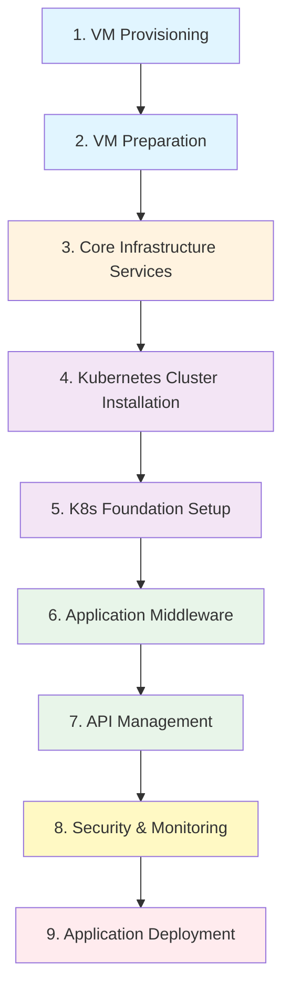

# Deployment Process

The deployment process is orchestrated by a series of Ansible roles, executed in a specific order to build the platform from the ground up. The sequence ensures a consistent and reliable setup.

## Deployment Sequence

## Phase 1: VM Provisioning

The process starts by provisioning the necessary virtual machines on the configured hypervisor (VMware or Nutanix).

**Ansible Roles:**

- `provisionnement-vms-infra`: Provision infrastructure VMs (Vault, Gogs, Monitoring)
- `provisionnement-vms-apps`: Provision application and middleware VMs (Kubernetes nodes, load balancers)

**Virtual Machines Created:**

- Kubernetes master and worker nodes (for RKE2-APPS, RKE2-MIDDLEWARE, RKE2-DMZ clusters)
- Load balancer VMs (LBLAN, LBDMZ, LBINTEGRATION)
- Infrastructure VMs (Vault, Gogs, Monitoring)

The VM specifications (CPU, RAM, disk) are dynamically calculated based on the configured number of concurrent users (100, 500, 1000, or 10000).

---

## Phase 2: VM Preparation

Once the VMs are created, they are prepared with the necessary base configuration.

**Ansible Role:** `prepare-vms`

**Configuration Tasks:**

- User account creation and SSH key setup
- Network configuration (static IPs, DNS, gateway)
- Hostname configuration
- Base packages installation
- Security hardening

---

## Phase 3: Core Infrastructure Services Installation

Essential services that live outside of Kubernetes are installed first.

**Services Deployed:**

### Docker Registry
**Role:** `install-docker-registry`
**Purpose:** Private registry to store all container images required for the platform
**Deployed on:** GITOPS VM

### HashiCorp Vault
**Role:** `install-vault`
**Purpose:** Centralized secrets management (credentials, certificates, API keys)
**Deployed on:** VAULT VM

### HAProxy Load Balancers
**Role:** `install-load-balancer`
**Purpose:** Manage and distribute traffic to services
**Deployed on:** LBLAN, LBDMZ, LBINTEGRATION VMs (2 nodes each for HA)

### Gogs Git Server
**Role:** `install-gogs`
**Purpose:** Self-hosted Git service acting as source of truth for GitOps workflow
**Deployed on:** GITOPS VM

---

## Phase 4: Kubernetes Cluster Installation

Three separate Kubernetes clusters are installed using **Rancher Kubernetes Engine 2 (RKE2)**.

**Ansible Roles:**

- `install-rke2-apps`: RKE2-APPS cluster for business applications
- `install-rke2-middleware`: RKE2-MIDDLEWARE cluster for middleware services
- `install-rke2-dmz`: RKE2-DMZ cluster in the DMZ zone for external API traffic
- `install-rancher-server`: Rancher management plane for ALL three clusters

**Cluster Architecture:**

| Cluster | Purpose | Managed By | Node Count |
|---------|---------|------------|------------|
| **RKE2-APPS** | Business applications (eServices, GCO) | Rancher | 3 masters + N workers (scales with user count) |
| **RKE2-MIDDLEWARE** | Middleware services (Keycloak, Kafka, etc.) | Rancher | 3 masters + N workers (scales with user count) |
| **RKE2-DMZ** | API Gateway for external traffic | Rancher | 3 nodes (fixed, small cluster) |

All clusters follow Kubernetes best practices with separate control plane and worker nodes for production deployments (500+ users).

---

## Phase 5: Kubernetes Cluster Foundation Setup

Foundational components are deployed on the clusters to enable storage, security, and GitOps.

**Services Deployed:**

### Argo CD
**Role:** `install-argocd`
**Purpose:** GitOps continuous delivery tool managing all subsequent deployments
**Deployed on:** RKE2-APPS, RKE2-MIDDLEWARE, RKE2-DMZ clusters

### Cert-manager
**Role:** `install-cert-manager`
**Purpose:** Automated TLS certificate management within Kubernetes
**Deployed on:** All RKE2 clusters

### Longhorn
**Role:** `install-longhorn`
**Purpose:** Distributed block storage for persistent data
**Deployed on:** RKE2-APPS, RKE2-MIDDLEWARE clusters

### Vault Injector
**Role:** `setup-vault-injector`
**Purpose:** Automatically inject secrets from Vault into application pods
**Deployed on:** All RKE2 clusters

---

## Phase 6: Application Middleware Deployment

A suite of middleware is deployed on the **RKE2-MIDDLEWARE** cluster to support applications.

**Services Deployed:**

| Middleware | Role | Purpose |
|------------|------|---------|
| **MinIO** | `install-minio` | S3-compatible object storage |
| **Keycloak** | `install-keycloak` | Identity and access management (IAM/SSO) |
| **Apache Kafka** | `install-kafka` | Distributed streaming platform for messaging |
| **n8n** | `install-n8n` | Workflow automation tool |
| **Flowable** | `install-flowable` | BPM engine (deployed if eServices product selected) |

All middleware services are deployed via Argo CD using the GitOps workflow.

---

## Phase 7: API Management Deployment

API management platforms are deployed to secure and manage API traffic.

**Services Deployed:**

### Gravitee LAN
**Role:** `install-gravitee-lan`
**Purpose:** Manage and secure internal APIs
**Deployed on:** RKE2-APPS cluster
**Access:** Internal users via LBLAN

### Gravitee DMZ
**Role:** `install-gravitee-dmz`
**Purpose:** Manage and secure API traffic from external users and mobile applications
**Deployed on:** RKE2-DMZ cluster
**Access:** External users via LBDMZ

API calls from external sources are routed: `LBDMZ` → `Gravitee DMZ` → `LBLAN` → `Backend APIs`.

---

## Phase 8: Security and Monitoring Deployment

Security scanning and observability tools are deployed across the platform.

**Services Deployed:**

### Neuvector
**Role:** `install-neuvector`
**Purpose:** Container security platform (vulnerability scanning, runtime protection, network segmentation)
**Deployed on:** All RKE2 clusters

### Coroot
**Role:** `install-monitoring`
**Purpose:** Monitoring and observability platform
**Deployed on:** Monitoring VM (server) + agents on all clusters and load balancers
**Coverage:** RKE2-APPS, RKE2-MIDDLEWARE, RKE2-DMZ, LBLAN, LBDMZ, LBINTEGRATION

---

## Phase 9: Application Deployment

Finally, the business applications are deployed onto the **RKE2-APPS** cluster.

**Applications Deployed:**

### eServices Microservices
**Role:** `install-eservices`
**Description:** Citizen-facing e-government services platform with front office, back office, and internal portals
**Components:**
- E-Services Front Office (public portal)
- E-Services Front Office Interne (internal portal)
- E-Services Back Office (administrative portal)

### GCO
**Role:** `install-gco`
**Description:** Operations management portal for internal/backoffice users

Both applications are deployed via Argo CD and managed through the GitOps workflow.

---

!!! success "Deployment Complete"
    After Phase 9, the platform is fully operational with all infrastructure, middleware, and applications running in a highly available, secure, and scalable configuration.

!!! info "Next Steps"
    Learn more about the [Components](components/infrastructure.md) that make up this platform.
