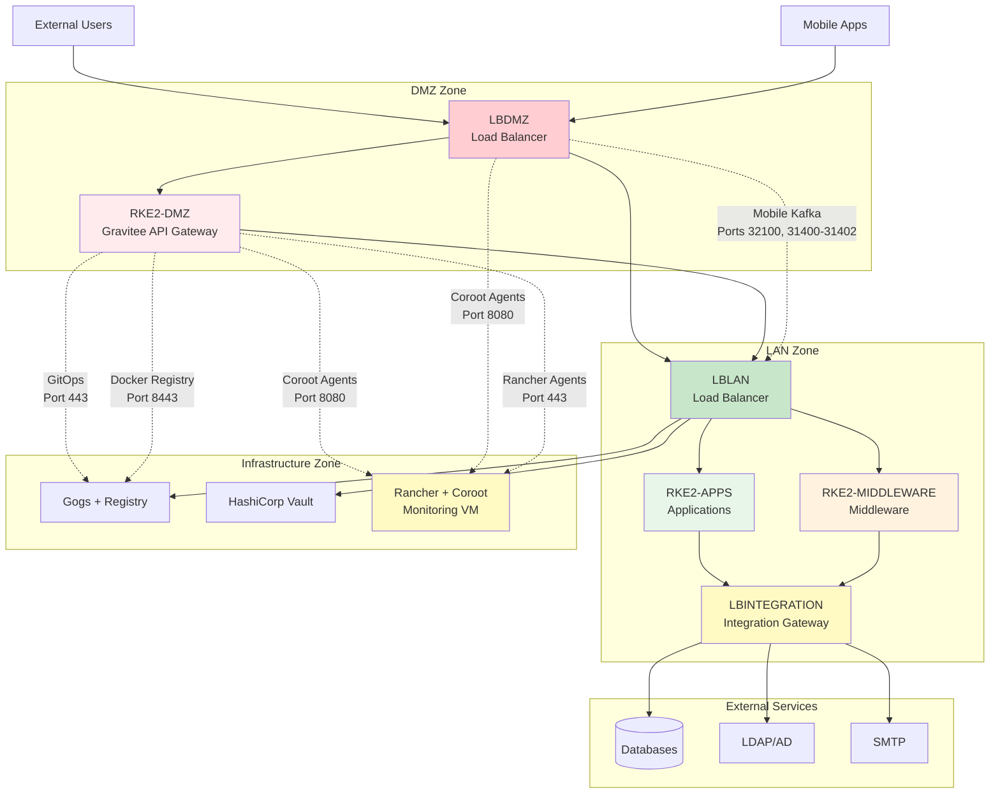

# Flow Matrix

This document details the primary communication flows between the different Ansible groups, as managed by the load balancers. Understanding these flows is essential for configuring firewalls, troubleshooting connectivity issues, and optimizing network performance.

## Traffic Flow Overview



---

## Detailed Flow Matrix

The following table provides a comprehensive view of all traffic flows in the platform.

### External Traffic Flows

| Source | Destination | Destination Port | Protocol | Description |
|--------|-------------|-----------------|----------|-------------|
| **External User** | `LBDMZ` | 443 | TCP/HTTPS | Main application traffic from external users, routed to `RKEAPPS` cluster (static content) or `RKEDMZ` cluster (APIs) |
| **Mobile Application** | `LBDMZ` | 32100, 31400-31402 | TCP | Mobile app traffic to Kafka brokers, routed to `RKEMIDDLEWARE` cluster via `LBLAN` |

### Internal User Traffic

| Source | Destination | Destination Port | Protocol | Description |
|--------|-------------|-----------------|----------|-------------|
| **Internal User** | `LBLAN` | 443 | TCP/HTTPS | Main application traffic (e.g., eServices, GCO), routed to `RKEAPPS` cluster |
| **Admin User** | `LBLAN` | 443 | TCP/HTTPS | Middleware UI/API access (Keycloak, MinIO, n8n, Flowable), routed to `RKEMIDDLEWARE` cluster |
| **Admin User** | `LBLAN` | 443 | TCP/HTTPS | Rancher management UI, routed to `monitoring` group (backend port 443) |
| **Admin User** | `LBLAN` | 443 | TCP/HTTPS | Gogs Git server UI/API, routed to `gitops` group (backend port 443) |
| **Admin User** | `LBLAN` | 443 | TCP/HTTPS | Coroot monitoring dashboard, routed to `monitoring` group (backend port 8080) |
| **Admin User** | `LBLAN` | 443 | TCP/HTTPS | MinIO Backup UI, routed to `monitoring` group (backend port 9001) |

### GitOps and CI/CD Flows

| Source | Destination | Destination Port | Protocol | Description |
|--------|-------------|-----------------|----------|-------------|
| **`RKEAPPS` / `RKEMIDDLEWARE`** (ArgoCD) | `LBLAN` | 443 | TCP/HTTPS | GitOps traffic from ArgoCD to Gogs, routed to `gitops` group |
| **`RKEDMZ`** (ArgoCD DMZ) | `gitops` | 443 | TCP/HTTPS | GitOps traffic: ArgoCD DMZ pulling configurations from Gogs |
| **`RKEDMZ`** | `gitops` | 8443 | TCP/HTTPS | Docker Registry access: RKEDMZ pulling container images from private registry |
| **K8s Nodes / CI/CD** | `LBLAN` | 443 | TCP/HTTPS | Container image pulls/pushes via hostname, routed to `gitops` group (backend port 8443) |

### DMZ Cluster Traffic

| Source | Destination | Destination Port | Protocol | Description |
|--------|-------------|-----------------|----------|-------------|
| **`RKEDMZ`** (Gravitee DMZ) | `LBLAN` | 443 | TCP/HTTPS | API proxy traffic from Gravitee DMZ to backend services in `RKEAPPS` or `RKEMIDDLEWARE` clusters |
| **`LBDMZ`** | `LBLAN` | 443 | TCP/HTTPS | Static content routing from `LBDMZ` to `LBLAN` for delivery to `RKEAPPS` cluster |
| **`RKEDMZ`** (Gravitee DMZ) | `vault` | 443 | TCP/HTTPS | Secret retrieval: Gravitee DMZ accessing Vault via LBLAN (443→8200) |

### Monitoring Flows

| Source | Destination | Destination Port | Protocol | Description |
|--------|-------------|-----------------|----------|-------------|
| **`RKEDMZ`** (Coroot Agents) | `monitoring` | 8080 | TCP | Monitoring: Coroot agents in RKE2-DMZ forwarding metrics directly to Coroot server on monitoring VM |
| **`LBDMZ`** (Coroot Agents) | `monitoring` | 8080 | TCP | Monitoring: Coroot agents on LB DMZ forwarding metrics directly to Coroot server on monitoring VM |

### Direct Connections (Bypass Load Balancers)

| Source | Destination | Destination Port | Protocol | Description |
|--------|-------------|-----------------|----------|-------------|
| **`RKEAPPS` / `RKEMIDDLEWARE`** | `vault` | 8200 | TCP/HTTPS | **Direct Connection:** Secret retrieval from HashiCorp Vault |
| **`RKEAPPS` / `RKEMIDDLEWARE`** | `monitoring` | 9000 | TCP/S3 | **Direct Connection:** Longhorn sending backups to the MinIO Backup S3 endpoint |

### Kafka Messaging Flows

| Source | Destination | Destination Port | Protocol | Description |
|--------|-------------|-----------------|----------|-------------|
| **`RKEAPPS`** | `LBLAN` | 32100 | TCP | Kafka initial bootstrap connection, routed to `RKEMIDDLEWARE` cluster |
| **`RKEAPPS`** | `LBLAN` | 31400-31402 | TCP | Kafka broker connections, routed to `RKEMIDDLEWARE` cluster |

### External Service Integration Flows

| Source | Destination | Destination Port | Protocol | Description |
|--------|-------------|-----------------|----------|-------------|
| **`RKEAPPS` / `RKEMIDDLEWARE`** | `LBINTEGRATION` | (variable) | TCP | SMTP traffic to external mail server |
| **`RKEAPPS` / `RKEMIDDLEWARE`** | `LBINTEGRATION` | (variable) | TCP | Connection to external databases (PostgreSQL, Informix, SIG) |
| **`RKEAPPS` / `RKEMIDDLEWARE`** | `LBINTEGRATION` | (variable) | TCP | Connection to external LDAP / Active Directory services |
| **`RKEAPPS`** | `LBINTEGRATION` | (variable) | TCP | Connection to external providers (SMS, Payment) |
| **`RKEAPPS`** | `LBINTEGRATION` | (variable) or fixed | TCP/HTTPS | Connection to external application services (ArcGIS, Alfresco, GMAO, etc.) |

### Cluster Management Flows

| Source | Destination | Destination Port | Protocol | Description |
|--------|-------------|-----------------|----------|-------------|
| **RKEDMZ** (Rancher Agents) | `monitoring` (Rancher) | 443 | TCP/HTTPS | Rancher agent communication from RKE2-DMZ cluster to Rancher Server |

---

## Flow Categories

### 1. North-South Traffic (External ↔ Internal)

**Entry Point:** LBDMZ

**Flows:**

- External users accessing web applications
- Mobile applications connecting to backend services
- API calls from external systems

**Security:**

- All traffic inspected at DMZ boundary
- API calls secured by Gravitee API Gateway
- Static content cached at edge

### 2. East-West Traffic (Internal ↔ Internal)

**Hub:** LBLAN

**Flows:**

- Microservice-to-microservice communication
- Application-to-middleware communication
- Administrative access to dashboards

**Security:**

- Internal network segmentation
- Service-to-service authentication
- TLS encryption for sensitive data

### 3. Integration Traffic (Internal → External)

**Gateway:** LBINTEGRATION

**Flows:**

- Database queries to external systems
- LDAP/AD authentication
- Email delivery via SMTP
- SMS and payment gateway integration
- GIS and document management system access

**Security:**

- Single egress point for firewall rules
- Credential management via Vault
- Connection pooling and rate limiting
- Audit logging of all external calls

### 4. Management Traffic

**Destinations:** Gitops, Vault, Monitoring VMs

**Flows:**

- GitOps workflows (Argo CD → Gogs)
- Secret retrieval (Apps → Vault)
- Monitoring data collection (Agents → Coroot)
- Cluster management (Rancher ↔ Clusters)

**Security:**

- Administrative access restricted
- Secret injection via Vault Injector
- Encrypted communication channels

---

## Port Reference

### Standard HTTPS Ports

| Port | Service | Used By |
|------|---------|---------|
| **443** | HTTPS | LBDMZ, LBLAN (frontend), Rancher, Gogs, Vault, Keycloak, MinIO UI, Gravitee, Argo CD, Neuvector, etc. |
| **8443** | Docker Registry | LBLAN → Docker Registry |

### Backend Service Ports

| Port | Service | Used By |
|------|---------|---------|
| **8200** | HashiCorp Vault | Vault Injector, applications |
| **8080** | Coroot Server | Coroot agents |
| **9000** | MinIO S3 API | Applications, Longhorn backup |
| **9001** | MinIO Console | MinIO Backup UI |

### Kafka Ports

| Port | Service | Used By |
|------|---------|---------|
| **32100** | Kafka Bootstrap | Initial Kafka connection |
| **31400-31402** | Kafka Brokers | Kafka producer/consumer traffic |

### External Service Ports (via LBINTEGRATION)

| Port Range | Service | Examples |
|------------|---------|----------|
| **25, 587, 465** | SMTP | Email delivery |
| **389, 636** | LDAP/LDAPS | Directory services |
| **5432** | PostgreSQL | Database connections |
| **9088** | Informix | Legacy database |
| **443** | HTTPS APIs | Payment, SMS, Cloud services |
| **6443** | ArcGIS | GIS services |

---

## Network Security Zones

### DMZ Zone Security

**Inbound Rules:**

- Allow 443 from Internet → LBDMZ
- Allow 32100, 31400-31402 from Internet → LBDMZ (mobile Kafka)

**Outbound Rules:**

- Allow 443 from LBDMZ → LBLAN
- Allow 443 from RKEDMZ → LBLAN
- Allow 443 from RKEDMZ → Gitops
- Allow 8080 from RKEDMZ/LBDMZ → LBLAN

**Deny:** All other traffic

### LAN Zone Security

**Inbound Rules:**

- Allow 443, 8080 from DMZ → LBLAN
- Allow all from LAN VMs to each other

**Outbound Rules:**

- Allow specific ports from LBINTEGRATION → External Services
- Allow 8200 from clusters → Vault
- Allow 9000 from clusters → Monitoring (MinIO Backup)

**Deny:** Direct access from Internet to LAN

### Infrastructure Zone Security

**Inbound Rules:**

- Allow 443 from LBLAN → Gitops, Rancher
- Allow 8200 from all clusters → Vault
- Allow 8080 from all agents → Coroot

**Outbound Rules:**

- Minimal outbound (infrastructure is mostly destination)

**Deny:** Direct Internet access to infrastructure VMs

---

## Firewall Configuration

When configuring firewalls, use this flow matrix to create precise security rules. The following tables outline the essential ports that must be opened between network zones.

### DMZ to LAN Communication

These ports must be opened from the DMZ zone to the LAN zone:

| Port(s) | Protocol | Destination | Purpose |
|---------|----------|-------------|---------|
| **443** | TCP/HTTPS | LBLAN | Static content routing, API proxy traffic, administrative access |
| **8200** | TCP/HTTPS | Vault | Secret retrieval via HAProxy port transformation (443→8200) |
| **9000** | TCP/S3 | Monitoring (MinIO Backup) | Longhorn backup storage |
| **443** | TCP/HTTPS | Gitops | ArgoCD DMZ pulling configurations from Gogs |
| **8443** | TCP/HTTPS | Gitops | Docker Registry access for RKEDMZ pulling container images |
| **8080** | TCP | Monitoring | Coroot agents forwarding metrics to Coroot server |
| **32100, 31400-31402** | TCP | LBLAN | Mobile Kafka traffic routed to RKEMIDDLEWARE cluster |

### LAN to External Communication

These ports must be opened from the LAN zone to external services:

| Port(s) | Protocol | Destination | Purpose |
|---------|----------|-------------|---------|
| **5432** | TCP | External PostgreSQL | Database connections |
| **9088** | TCP | External Informix | Legacy database connections |
| **389, 636** | TCP/LDAP/LDAPS | External LDAP/AD | Directory service authentication |
| **25, 587, 465** | TCP/SMTP | External SMTP | Email delivery |

### Firewall Rule Best Practices

**DMZ Zone Firewall Rules:**

```
# Inbound rules (from Internet)
ALLOW TCP 443 → LBDMZ
ALLOW TCP 32100,31400-31402 → LBDMZ

# Outbound rules (to LAN)
ALLOW TCP 443 → LBLAN
ALLOW TCP 443 → Gitops
ALLOW TCP 8443 → Gitops
ALLOW TCP 443 → Vault (transformed to 8200 internally)
ALLOW TCP 8080 → Monitoring
ALLOW TCP 32100,31400-31402 → LBLAN

# Deny all other traffic
DENY ALL
```

**LAN Zone Firewall Rules:**

```
# Inbound rules (from DMZ)
ALLOW TCP 443,8080 → LBLAN

# Outbound rules (to External)
ALLOW TCP 5432 → External PostgreSQL
ALLOW TCP 9088 → External Informix
ALLOW TCP 389,636 → External LDAP/AD
ALLOW TCP 25,587,465 → External SMTP

# Deny direct Internet access
DENY ALL FROM Internet
```

**Infrastructure Zone Firewall Rules:**

```
# Inbound rules (from LAN)
ALLOW TCP 443 → Gitops, Rancher
ALLOW TCP 8200 → Vault (from clusters)
ALLOW TCP 8080 → Coroot (from agents)

# Deny direct Internet access
DENY ALL FROM Internet
```

### Configuration Tips

- **Load Balancer Proxies**: Most inter-zone traffic flows through load balancers (LBLAN, LBDMZ) for centralized control and monitoring
- **Direct Connections**: Some services (Vault, MinIO Backup, Coroot, Gogs) require direct VM-to-VM connectivity and cannot traverse load balancers
- **Port Transformation**: HAProxy on LBLAN handles port transformation for Vault (443→8200) and other services
- **Monitoring**: All firewall rule changes should be logged and monitored for security auditing
- **Testing**: Verify connectivity after applying rules using tools like `telnet`, `nc`, or application-specific health checks

---

## Troubleshooting Guide

### External Users Cannot Access Application

**Check:**

1. Firewall allows 443 to LBDMZ
2. LBDMZ is routing to LBLAN (for static content) or RKEDMZ (for APIs)
3. LBLAN is routing to RKEAPPS
4. Application pods are running in RKEAPPS cluster

### Mobile App Cannot Connect to Kafka

**Check:**

1. Firewall allows 32100, 31400-31402 to LBDMZ
2. LBDMZ routes to LBLAN
3. LBLAN routes to RKEMIDDLEWARE Kafka NodePorts
4. Kafka brokers are running and healthy

### ArgoCD Cannot Pull from Gogs

**Check:**

1. LBLAN routes port 443 to Gitops VM
2. Gogs service is running
3. ArgoCD has correct Gogs credentials
4. Network connectivity between ArgoCD pods and LBLAN

### Application Cannot Retrieve Secrets

**Check:**

1. Vault service is running
2. Direct connection from cluster to Vault VM on port 8200
3. Vault Injector is deployed on the cluster
4. Service account has correct Vault permissions

---

!!! info "Performance Optimization"
    - **Kafka traffic**: Uses NodePort for direct pod access (lower latency)
    - **Static content**: Can be cached at LBDMZ for faster delivery
    - **API Gateway**: Gravitee DMZ provides rate limiting and caching

---

This comprehensive flow matrix ensures secure, efficient, and well-organized traffic routing across the entire SRM-CS platform architecture.
