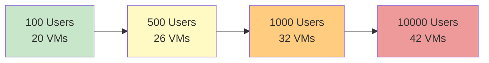

# VM Configurations

The platform dynamically adjusts VM specifications based on the `number_concurrent_users` configuration. This page provides detailed specifications for each user count tier.

## Configuration Summary

| User Count | Architecture Pattern | Total VMs | Use Case |
|------------|---------------------|-----------|----------|
| **100** | Combined roles | ~20 VMs | Development, testing, small deployments |
| **500** | Separated roles | ~26 VMs | Small to medium production |
| **1000** | Separated roles + scaled workers | ~32 VMs | Medium to large production |
| **10000** | Enterprise scale | ~46 VMs | Large enterprise production |

---

## 100 Users (Combined Architecture)

**Architecture Pattern:** Control plane nodes handle ALL roles (control + compute + storage)

### Kubernetes Clusters

| VM Type | Nodes | CPU/Node | RAM/Node | OS Disk | Data Disk | Roles |
|---------|-------|----------|----------|---------|-----------|-------|
| **RKEAPPS_CONTROL** | 3 | 4 | 8 GB | 60 GB | 100 GB | master,worker,cns |
| **RKEAPPS_CNS** | 0 | - | - | - | - | - |
| **RKEAPPS_WORKER** | 0 | - | - | - | - | - |
| **RKEMIDDLEWARE_CONTROL** | 3 | 4 | 8 GB | 60 GB | 100 GB | master,worker,cns |
| **RKEMIDDLEWARE_CNS** | 0 | - | - | - | - | - |
| **RKEMIDDLEWARE_WORKER** | 0 | - | - | - | - | - |
| **RKEDMZ** | 3 | 4 | 4 GB | 60 GB | 100 GB | master,worker,cns |

### Load Balancers

| VM Type | Nodes | CPU/Node | RAM/Node | OS Disk | Data Disk | Roles |
|---------|-------|----------|----------|---------|-----------|-------|
| **LBLAN** | 2 | 2 | 2 GB | 60 GB | 0 GB | loadbalancer |
| **LBDMZ** | 2 | 2 | 2 GB | 60 GB | 0 GB | loadbalancer |
| **LBINTEGRATION** | 2 | 2 | 2 GB | 60 GB | 0 GB | loadbalancer |

### Infrastructure

| VM Type | Nodes | CPU/Node | RAM/Node | OS Disk | Data Disk | Roles |
|---------|-------|----------|----------|---------|-----------|-------|
| **GITOPS** | 1 | 4 | 8 GB | 60 GB | 200 GB | git,docker-registry |
| **MONITORING** | 1 | 4 | 16 GB | 80 GB | 200 GB | admin,monitoring |
| **VAULT** | 1 | 4 | 16 GB | 80 GB | 200 GB | vault |

### Resource Totals (100 Users)

- **Total VMs**: 20
- **Total CPUs**: 48 cores
- **Total RAM**: 124 GB
- **Total OS Disks**: 1,240 GB
- **Total Data Disks**: 1,700 GB

---

## 500 Users (Separated Architecture)

**Architecture Pattern:** Separated control plane, dedicated CNS storage, initial worker nodes

### Kubernetes Clusters

| VM Type | Nodes | CPU/Node | RAM/Node | OS Disk | Data Disk | Roles |
|---------|-------|----------|----------|---------|-----------|-------|
| **RKEAPPS_CONTROL** | 3 | 4 | 8 GB | 60 GB | 0 GB | master |
| **RKEAPPS_CNS** | 3 | 4 | 8 GB | 80 GB | 100 GB | worker,cns |
| **RKEAPPS_WORKER** | 1 | 4 | 8 GB | 80 GB | 0 GB | worker |
| **RKEMIDDLEWARE_CONTROL** | 3 | 4 | 8 GB | 60 GB | 0 GB | master |
| **RKEMIDDLEWARE_CNS** | 3 | 4 | 8 GB | 80 GB | 100 GB | worker,cns |
| **RKEMIDDLEWARE_WORKER** | 1 | 4 | 8 GB | 80 GB | 0 GB | worker |
| **RKEDMZ** | 3 | 4 | 8 GB | 60 GB | 100 GB | master,worker,cns |

### Load Balancers

| VM Type | Nodes | CPU/Node | RAM/Node | OS Disk | Data Disk | Roles |
|---------|-------|----------|----------|---------|-----------|-------|
| **LBLAN** | 2 | 4 | 4 GB | 60 GB | 0 GB | loadbalancer |
| **LBDMZ** | 2 | 4 | 4 GB | 60 GB | 0 GB | loadbalancer |
| **LBINTEGRATION** | 2 | 2 | 2 GB | 60 GB | 0 GB | loadbalancer |

### Infrastructure

| VM Type | Nodes | CPU/Node | RAM/Node | OS Disk | Data Disk | Roles |
|---------|-------|----------|----------|---------|-----------|-------|
| **GITOPS** | 1 | 4 | 8 GB | 60 GB | 200 GB | git,docker-registry |
| **MONITORING** | 1 | 4 | 16 GB | 80 GB | 200 GB | admin,monitoring |
| **VAULT** | 1 | 4 | 16 GB | 80 GB | 200 GB | vault |

### Resource Totals (500 Users)

- **Total VMs**: 26
- **Total CPUs**: 92 cores
- **Total RAM**: 180 GB
- **Total OS Disks**: 1,640 GB
- **Total Data Disks**: 1,200 GB

---

## 1000 Users (Scaled Separated Architecture)

**Architecture Pattern:** Separated roles with increased worker nodes and storage capacity

### Kubernetes Clusters

| VM Type | Nodes | CPU/Node | RAM/Node | OS Disk | Data Disk | Roles |
|---------|-------|----------|----------|---------|-----------|-------|
| **RKEAPPS_CONTROL** | 3 | 4 | 8 GB | 60 GB | 0 GB | master |
| **RKEAPPS_CNS** | 3 | 4 | 8 GB | 80 GB | 200 GB | worker,cns |
| **RKEAPPS_WORKER** | 5 | 8 | 16 GB | 80 GB | 0 GB | worker |
| **RKEMIDDLEWARE_CONTROL** | 3 | 4 | 8 GB | 60 GB | 0 GB | master |
| **RKEMIDDLEWARE_CNS** | 3 | 4 | 8 GB | 80 GB | 200 GB | worker,cns |
| **RKEMIDDLEWARE_WORKER** | 4 | 8 | 16 GB | 80 GB | 0 GB | worker |
| **RKEDMZ** | 3 | 6 | 8 GB | 80 GB | 150 GB | master,worker,cns |

### Load Balancers

| VM Type | Nodes | CPU/Node | RAM/Node | OS Disk | Data Disk | Roles |
|---------|-------|----------|----------|---------|-----------|-------|
| **LBLAN** | 2 | 4 | 4 GB | 60 GB | 0 GB | loadbalancer |
| **LBDMZ** | 2 | 4 | 4 GB | 60 GB | 0 GB | loadbalancer |
| **LBINTEGRATION** | 2 | 4 | 4 GB | 60 GB | 0 GB | loadbalancer |

### Infrastructure

| VM Type | Nodes | CPU/Node | RAM/Node | OS Disk | Data Disk | Roles |
|---------|-------|----------|----------|---------|-----------|-------|
| **GITOPS** | 1 | 4 | 8 GB | 60 GB | 200 GB | git,docker-registry |
| **MONITORING** | 1 | 6 | 20 GB | 80 GB | 200 GB | admin,monitoring |
| **VAULT** | 1 | 4 | 16 GB | 80 GB | 200 GB | vault |

### Resource Totals (1000 Users)

- **Total VMs**: 32
- **Total CPUs**: 168 cores
- **Total RAM**: 328 GB
- **Total OS Disks**: 2,160 GB
- **Total Data Disks**: 1,750 GB

---

## 10000 Users (Enterprise Architecture)

**Architecture Pattern:** Maximum scale with extensive worker nodes and storage

### Kubernetes Clusters

| VM Type | Nodes | CPU/Node | RAM/Node | OS Disk | Data Disk | Roles |
|---------|-------|----------|----------|---------|-----------|-------|
| **RKEAPPS_CONTROL** | 3 | 4 | 8 GB | 80 GB | 0 GB | master |
| **RKEAPPS_CNS** | 3 | 4 | 8 GB | 80 GB | 400 GB | worker,cns |
| **RKEAPPS_WORKER** | 6 | 8 | 16 GB | 80 GB | 0 GB | worker |
| **RKEMIDDLEWARE_CONTROL** | 3 | 4 | 8 GB | 80 GB | 0 GB | master |
| **RKEMIDDLEWARE_CNS** | 3 | 4 | 8 GB | 80 GB | 500 GB | worker,cns |
| **RKEMIDDLEWARE_WORKER** | 12 | 8 | 16 GB | 80 GB | 0 GB | worker |
| **RKEDMZ** | 3 | 8 | 16 GB | 80 GB | 200 GB | master,worker,cns |

### Load Balancers

| VM Type | Nodes | CPU/Node | RAM/Node | OS Disk | Data Disk | Roles |
|---------|-------|----------|----------|---------|-----------|-------|
| **LBLAN** | 2 | 8 | 8 GB | 80 GB | 0 GB | loadbalancer |
| **LBDMZ** | 2 | 8 | 8 GB | 80 GB | 0 GB | loadbalancer |
| **LBINTEGRATION** | 2 | 4 | 8 GB | 60 GB | 0 GB | loadbalancer |

### Infrastructure

| VM Type | Nodes | CPU/Node | RAM/Node | OS Disk | Data Disk | Roles |
|---------|-------|----------|----------|---------|-----------|-------|
| **GITOPS** | 1 | 8 | 16 GB | 80 GB | 500 GB | git,docker-registry |
| **MONITORING** | 1 | 8 | 32 GB | 100 GB | 500 GB | admin,monitoring |
| **VAULT** | 1 | 4 | 16 GB | 80 GB | 500 GB | vault |

### Resource Totals (10000 Users)

- **Total VMs**: 42
- **Total CPUs**: 288 cores
- **Total RAM**: 616 GB
- **Total OS Disks**: 3,340 GB
- **Total Data Disks**: 3,200 GB

---

## Scaling Comparison

### VM Count Scaling

### Resource Scaling

| Metric | 100 Users | 500 Users | 1000 Users | 10000 Users | Growth Factor (100→10000) |
|--------|-----------|-----------|------------|-------------|--------------------------|
| **VMs** | 20 | 26 | 32 | 42 | 2.1x |
| **CPUs** | 48 | 92 | 168 | 288 | 6x |
| **RAM (GB)** | 124 | 180 | 328 | 616 | 5x |
| **OS Disk (GB)** | 1,240 | 1,640 | 2,160 | 3,340 | 2.7x |
| **Data Disk (GB)** | 1,700 | 1,200 | 1,750 | 3,200 | 1.9x |

---

## Key Observations

### Architecture Transition

- **100 users → 500 users**: Fundamental shift from combined to separated architecture
- **500 users → 1000 users**: Horizontal scaling of worker nodes
- **1000 users → 10000 users**: Massive horizontal scaling + increased per-node resources

### Resource Allocation Strategy

1. **CPU Scaling**: Most aggressive scaling (6x growth)
2. **RAM Scaling**: Follows CPU scaling closely (5x growth)
3. **VM Count**: Most conservative scaling (2.1x growth)
4. **Storage**: Data disk growth is moderate (1.9x) due to efficient storage architecture (Longhorn replication)

### Cost Optimization

- **100 users**: Minimal footprint for dev/test environments
- **500+ users**: Production-ready with optimal resource separation
- **Horizontal scaling**: Additional capacity added via worker nodes, not by resizing existing VMs

---

!!! info "Dynamic Configuration"
    These configurations are stored in the `VMConfiguration` table and automatically applied during architecture scaffolding. Custom configurations can be defined for specific requirements.

!!! tip "Capacity Planning"
    - Start with 100-user configuration for development
    - Use 500-user configuration for small production deployments
    - Scale to 1000+ users as demand grows
    - 10000-user configuration supports large government enterprises

!!! warning "Hardware Requirements"
    Ensure your hypervisor has sufficient resources:

    - **For 100 users**: ~50 CPU cores, ~130 GB RAM, ~3 TB storage
    - **For 10000 users**: ~300 CPU cores, ~650 GB RAM, ~7 TB storage

    Include overhead for hypervisor management (typically 10-15% additional resources).

---

!!! tip "Next Steps"
    Review the [Flow Matrix](flow-matrix.md) to understand traffic routing between these VMs.
