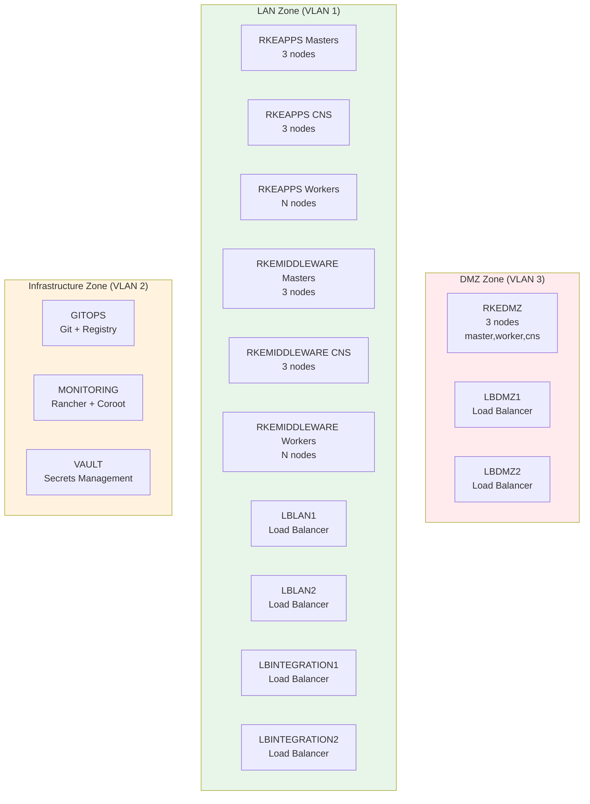

# Virtual Machines and Networks

The virtual machine architecture is defined in the `scaffold_architecture` function within `repository.py`. The function provisions VMs with specific roles and Ansible groups, distributed across different network zones.

## VM Architecture Overview



---

## VM Sizing Strategy

The platform supports **dynamic VM scaling** based on the configured number of concurrent users.

### Supported User Counts

- **100 users**: Small deployment with combined roles
- **500 users**: Medium deployment with separated roles
- **1000 users**: Large deployment with increased worker nodes
- **10000 users**: Enterprise deployment with maximum resources

VM specifications are stored in the `VMConfiguration` table and automatically applied during architecture scaffolding.

---

## VM Configuration Model

Each VM configuration includes:

| Attribute | Description |
|-----------|-------------|
| **User Count** | Target concurrent users (100, 500, 1000, 10000) |
| **VM Type** | Category of VM (e.g., RKEAPPS_CONTROL, LBLAN) |
| **Node Count** | Number of VMs to create for this type |
| **CPU per Node** | CPU cores allocated per VM |
| **RAM per Node** | RAM in MB per VM |
| **OS Disk Size** | Operating system disk size in GB |
| **Data Disk Size** | Data disk size in GB (0 for load balancers) |
| **Roles** | Ansible roles assigned to the VM |

---

## Kubernetes RKE2 Architecture Constraints

The platform implements **Kubernetes RKE2 best practices**:

### Control Plane Nodes (Kubernetes Masters)

- **Maximum 3 master nodes per cluster** (RKE2 requirement)
- **Combined roles**: "master,worker,cns" (for 100 users) or "master" only (for 500+ users)
- **VM Types**: `RKEAPPS_CONTROL`, `RKEMIDDLEWARE_CONTROL`, `RKEDMZ`
- **Hostname pattern**: `{vm_type}-master1`, `{vm_type}-master2`, `{vm_type}-master3`

### Worker Nodes

- **Unlimited worker nodes** (scales with user count)
- **Worker-only role**: "worker"
- **VM Types**: `RKEAPPS_WORKER`, `RKEMIDDLEWARE_WORKER`
- **Hostname pattern**: `{vm_type}-worker1`, `{vm_type}-worker2`, ..., `{vm_type}-workerN`

### Load Balancers

- **Always exactly 2 VMs for HA** (fixed count, active-passive pair)
- **Scale only CPU and RAM**, not disk
- **Data disk always 0 GB**
- **VM Types**: `LBLAN`, `LBDMZ`, `LBINTEGRATION`

### RKE2-DMZ Cluster

- **Always exactly 3 VMs** (fixed count, small cluster)
- **Combined roles**: "master,worker,cns"
- **VM Type**: `RKEDMZ`
- **Hostname pattern**: `rkedmz1`, `rkedmz2`, `rkedmz3`

---

## VM Type Categories

### Control Plane VMs (3 nodes each, fixed)

| VM Type | Node Count | Roles (100 users) | Roles (500+ users) |
|---------|------------|-------------------|--------------------|
| **RKEAPPS_CONTROL** | 3 | master,worker,cns | master |
| **RKEMIDDLEWARE_CONTROL** | 3 | master,worker,cns | master |
| **RKEDMZ** | 3 | master,worker,cns | master,worker,cns |

### Dedicated CNS Storage VMs (for 500+ users)

| VM Type | Node Count | Roles | Purpose |
|---------|------------|-------|---------|
| **RKEAPPS_CNS** | 3 | worker,cns | Dedicated Longhorn storage for RKEAPPS |
| **RKEMIDDLEWARE_CNS** | 3 | worker,cns | Dedicated Longhorn storage for RKEMIDDLEWARE |

### Worker-Only VMs (scales with load)

| VM Type | Node Count | Roles | Scaling |
|---------|------------|-------|---------|
| **RKEAPPS_WORKER** | N | worker | Scales with user count |
| **RKEMIDDLEWARE_WORKER** | N | worker | Scales with user count |

### Load Balancer VMs (2 nodes each, fixed)

| VM Type | Node Count | Roles | Purpose |
|---------|------------|-------|---------|
| **LBLAN** | 2 | loadbalancer | LAN traffic routing |
| **LBDMZ** | 2 | loadbalancer | DMZ traffic routing |
| **LBINTEGRATION** | 2 | loadbalancer | External service integration |

### Infrastructure VMs (1 node each, fixed)

| VM Type | Node Count | Roles | Purpose |
|---------|------------|-------|---------|
| **GITOPS** | 1 | git,docker-registry | Git server + Docker Registry |
| **MONITORING** | 1 | admin,monitoring | Rancher + Coroot + MinIO Backup |
| **VAULT** | 1 | vault | HashiCorp Vault |

---

## Dual Architecture Pattern

The platform uses a **dual architecture pattern** to optimize resource allocation:

### Small Deployments (100 Users): Combined Roles

- **Control plane nodes** handle ALL roles: control + compute + storage
- **No dedicated CNS or worker nodes** needed
- **Simpler architecture** with fewer VMs (total: ~20 VMs)
- **Lower cost** for development/test environments

**Node Distribution:**

```
RKEAPPS: 3 masters (master,worker,cns)
RKEMIDDLEWARE: 3 masters (master,worker,cns)
RKEDMZ: 3 nodes (master,worker,cns)
Load Balancers: 6 VMs (2 each)
Infrastructure: 3 VMs
```

### Large Deployments (500+ Users): Separated Roles

- **Control plane nodes** handle ONLY control plane duties
- **Dedicated CNS nodes** provide distributed storage (Longhorn)
- **Dedicated worker nodes** handle application workloads
- **Better resource isolation** and scalability
- **Higher cost** but production-ready

**Node Distribution (500 users):**

```
RKEAPPS: 3 masters + 3 CNS + 1 worker = 7 nodes
RKEMIDDLEWARE: 3 masters + 3 CNS + 1 worker = 7 nodes
RKEDMZ: 3 nodes (master,worker,cns)
Load Balancers: 6 VMs
Infrastructure: 3 VMs
Total: ~26 VMs
```

---

## Data Disk Strategy

Only certain VM types receive data disks:

### VMs WITH Data Disks

- **RKEAPPS_CONTROL** (for Longhorn when combined mode)
- **RKEAPPS_CNS** (for Longhorn storage)
- **RKEAPPS_WORKER** (can be 0 if only compute)
- **RKEMIDDLEWARE_CONTROL** (for Longhorn when combined mode)
- **RKEMIDDLEWARE_CNS** (for Longhorn storage)
- **RKEMIDDLEWARE_WORKER** (can be 0 if only compute)
- **RKEDMZ** (for Longhorn storage)
- **GITOPS** (for Git repositories + Docker images)
- **MONITORING** (for Rancher data + backups)
- **VAULT** (for Vault storage backend)

### VMs WITHOUT Data Disks

- **LBLAN** (load balancers only route traffic)
- **LBDMZ** (load balancers only route traffic)
- **LBINTEGRATION** (load balancers only route traffic)

**Rationale:** Load balancers are stateless and do not require persistent storage. All configuration is managed via Ansible.

---

## Zone Mapping

VM types are automatically mapped to network zones:

| Network Zone | Zone ID | VM Types |
|--------------|---------|----------|
| **LAN** | 1 | RKEAPPS_CONTROL, RKEAPPS_CNS, RKEAPPS_WORKER, RKEMIDDLEWARE_CONTROL, RKEMIDDLEWARE_CNS, RKEMIDDLEWARE_WORKER, LBLAN, LBINTEGRATION |
| **INFRA** | 2 | GITOPS, MONITORING, VAULT |
| **DMZ** | 3 | RKEDMZ, LBDMZ |

Each zone has:

- **VLAN ID**: Network isolation
- **Subnet**: IP address range
- **Gateway**: Default gateway for zone
- **DNS Servers**: Zone-specific DNS configuration

---

## Dynamic Hostname Generation

VM hostnames are generated dynamically based on VM type, node index, and `env_prefix` from security configuration.

### Hostname Pattern

```
{env_prefix}-{vm_type_prefix}{node_number}
```

### Examples WITHOUT Prefix (env_prefix="")

**Control Plane VMs:**

- **RKEAPPS_CONTROL**: `rkeapp-master1`, `rkeapp-master2`, `rkeapp-master3`
- **RKEMIDDLEWARE_CONTROL**: `rkemiddleware-master1`, `rkemiddleware-master2`, `rkemiddleware-master3`
- **RKEDMZ**: `rkedmz1`, `rkedmz2`, `rkedmz3`

**CNS VMs:**

- **RKEAPPS_CNS**: `rkeapp-cns1`, `rkeapp-cns2`, `rkeapp-cns3`
- **RKEMIDDLEWARE_CNS**: `rkemiddleware-cns1`, `rkemiddleware-cns2`, `rkemiddleware-cns3`

**Worker VMs:**

- **RKEAPPS_WORKER**: `rkeapp-worker1`, `rkeapp-worker2`, ..., `rkeapp-workerN`
- **RKEMIDDLEWARE_WORKER**: `rkemiddleware-worker1`, `rkemiddleware-worker2`, ..., `rkemiddleware-workerN`

**Load Balancer VMs:**

- **LBLAN**: `lblan1`, `lblan2`
- **LBDMZ**: `lbdmz1`, `lbdmz2`
- **LBINTEGRATION**: `lbintegration1`, `lbintegration2`

**Infrastructure VMs:**

- **GITOPS**: `gitops`
- **MONITORING**: `monitoring`
- **VAULT**: `vault`

### Examples WITH Prefix (env_prefix="dev")

**Control Plane VMs:**

- **RKEAPPS_CONTROL**: `dev-rkeapp-master1`, `dev-rkeapp-master2`, `dev-rkeapp-master3`
- **RKEMIDDLEWARE_CONTROL**: `dev-rkemiddleware-master1`, `dev-rkemiddleware-master2`, `dev-rkemiddleware-master3`
- **RKEDMZ**: `dev-rkedmz1`, `dev-rkedmz2`, `dev-rkedmz3`

**Load Balancer VMs:**

- **LBLAN**: `dev-lblan1`, `dev-lblan2`
- **LBDMZ**: `dev-lbdmz1`, `dev-lbdmz2`
- **LBINTEGRATION**: `dev-lbintegration1`, `dev-lbintegration2`

**Infrastructure VMs:**

- **GITOPS**: `dev-gitops`
- **MONITORING**: `dev-monitoring`
- **VAULT**: `dev-vault`

### Benefits

- **Consistency**: VM hostnames and DNS records use the same naming convention
- **Environment Separation**: Prefix clearly identifies environment (dev, test, qa, prod)
- **Predictability**: Easy to identify VM purpose from hostname

---

!!! tip "Next Steps"
    - Review detailed [VM Configurations](vm-configurations.md) for specific CPU/RAM/disk specifications
    - Understand traffic routing in the [Flow Matrix](flow-matrix.md)
