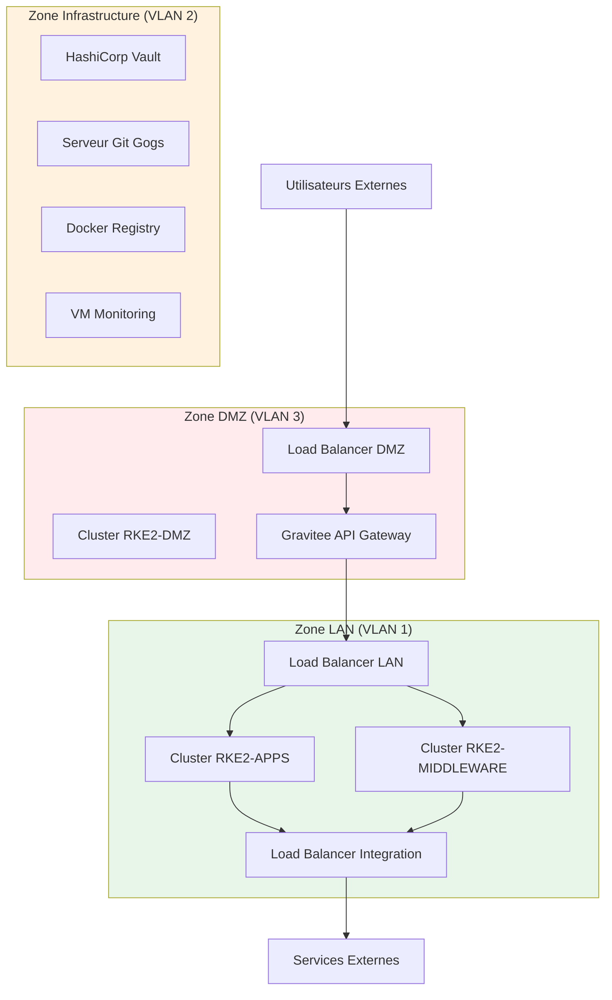

# Couche Infrastructure

La couche infrastructure fournit les ressources fondamentales de calcul, réseau et stockage pour l'ensemble de la plateforme.

## Plateforme Hyperviseur

La plateforme est déployée sur l'une des deux solutions d'hyperviseur d'entreprise :

=== "VMware vSphere/ESXi"
    - Plateforme de virtualisation standard de l'industrie
    - Fonctionnalités avancées : vMotion, DRS, HA
    - Intégré à l'écosystème VMware
    - Provisionnement automatisé via Ansible

=== "Nutanix AHV"
    - Infrastructure hyperconvergée
    - Stockage et réseau intégrés
    - Gestion simplifiée
    - Provisionnement automatisé via Ansible

Le choix de l'hyperviseur est configuré lors de la configuration de la plateforme et les deux sont entièrement supportés.

---

## Machines Virtuelles

Des machines virtuelles basées sur Linux sont provisionnées pour différents rôles à travers la plateforme.

### Catégories de VMs

| Catégorie VM | Objectif | Nombre | Évolutivité |
|-------------|---------|--------|-------------|
| **Masters Kubernetes** | Plan de contrôle pour les clusters RKE2 | 3 par cluster | Fixe (exigence RKE2) |
| **Workers Kubernetes** | Charges de travail applications et middleware | Variable | Échelle avec nombre d'utilisateurs |
| **Load Balancers** | Routage et distribution du trafic | 2 par type LB | Fixe (paire HA) |
| **Services Infrastructure** | Services de base (Vault, Gogs, Monitoring) | 1 par service | Fixe |

---

## Réseautage

La plateforme implémente une architecture réseau multi-zones pour la sécurité et l'isolation du trafic.

### VLANs et Zones Réseau

Pour plus de détails sur l'infrastructure, consultez la version anglaise ou référez-vous au document ARCHITECTURE.md source.

---

!!! tip "Prochaines Étapes"
    Explorez la [Couche Middleware](middleware.md) pour découvrir les services s'exécutant sur cette infrastructure.
