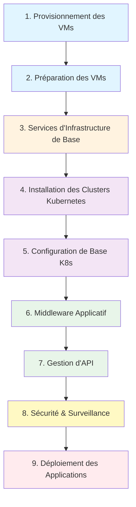

# Processus de Déploiement

Le processus de déploiement est orchestré par une série de rôles Ansible, exécutés dans un ordre spécifique pour construire la plateforme de bout en bout. La séquence assure une configuration cohérente et fiable.

## Séquence de Déploiement

## Phase 1 : Provisionnement des VMs

Le processus commence par le provisionnement des machines virtuelles nécessaires sur l'hyperviseur configuré (VMware ou Nutanix).

**Rôles Ansible :**

- `provisionnement-vms-infra` : Provisionne les VMs d'infrastructure (Vault, Gogs, Monitoring)
- `provisionnement-vms-apps` : Provisionne les VMs d'application et middleware (nœuds Kubernetes, load balancers)

**Machines Virtuelles Créées :**

- Nœuds maîtres et workers Kubernetes (pour les clusters RKE2-APPS, RKE2-MIDDLEWARE, RKE2-DMZ)
- VMs Load balancer (LBLAN, LBDMZ, LBINTEGRATION)
- VMs Infrastructure (Vault, Gogs, Monitoring)

Les spécifications des VMs (CPU, RAM, disque) sont calculées dynamiquement en fonction du nombre d'utilisateurs concurrents configurés (100, 500, 1000, ou 10000).

---

## Phase 2 : Préparation des VMs

Une fois les VMs créées, elles sont préparées avec la configuration de base nécessaire.

**Rôle Ansible :** `prepare-vms`

**Tâches de Configuration :**

- Création de comptes utilisateurs et configuration des clés SSH
- Configuration réseau (IPs statiques, DNS, passerelle)
- Configuration du nom d'hôte
- Installation des paquets de base
- Durcissement de la sécurité

---

## Phase 3 : Installation des Services d'Infrastructure de Base

Les services essentiels qui vivent en dehors de Kubernetes sont installés en premier.

**Services Déployés :**

### Docker Registry
**Rôle :** `install-docker-registry`
**Objectif :** Registre privé pour stocker toutes les images de conteneurs nécessaires à la plateforme
**Déployé sur :** VM GITOPS

### HashiCorp Vault
**Rôle :** `install-vault`
**Objectif :** Gestion centralisée des secrets (identifiants, certificats, clés API)
**Déployé sur :** VM VAULT

### Load Balancers HAProxy
**Rôle :** `install-load-balancer`
**Objectif :** Gérer et distribuer le trafic vers les services
**Déployé sur :** VMs LBLAN, LBDMZ, LBINTEGRATION (2 nœuds chacun pour HA)

### Serveur Git Gogs
**Rôle :** `install-gogs`
**Objectif :** Service Git auto-hébergé servant de source de vérité pour le workflow GitOps
**Déployé sur :** VM GITOPS

---

## Phase 4 : Installation des Clusters Kubernetes

Trois clusters Kubernetes séparés sont installés en utilisant **Rancher Kubernetes Engine 2 (RKE2)**.

**Rôles Ansible :**

- `install-rke2-apps` : Cluster RKE2-APPS pour les applications métier
- `install-rke2-middleware` : Cluster RKE2-MIDDLEWARE pour les services middleware
- `install-rke2-dmz` : Cluster RKE2-DMZ dans la zone DMZ pour le trafic API externe
- `install-rancher-server` : Plan de gestion Rancher pour les TROIS clusters

**Architecture des Clusters :**

| Cluster | Objectif | Géré Par | Nombre de Nœuds |
|---------|---------|----------|-----------------|
| **RKE2-APPS** | Applications métier (eServices, GCO) | Rancher | 3 masters + N workers (échelle avec nombre d'utilisateurs) |
| **RKE2-MIDDLEWARE** | Services middleware (Keycloak, Kafka, etc.) | Rancher | 3 masters + N workers (échelle avec nombre d'utilisateurs) |
| **RKE2-DMZ** | API Gateway pour trafic externe | Rancher | 3 nœuds (fixe, petit cluster) |

Tous les clusters suivent les meilleures pratiques Kubernetes avec des nœuds de plan de contrôle et workers séparés pour les déploiements production (500+ utilisateurs).

---

## Phase 5 : Configuration de Base des Clusters Kubernetes

Les composants fondamentaux sont déployés sur les clusters pour activer le stockage, la sécurité et GitOps.

**Services Déployés :**

### Argo CD
**Rôle :** `install-argocd`
**Objectif :** Outil de livraison continue GitOps gérant tous les déploiements subséquents
**Déployé sur :** Clusters RKE2-APPS, RKE2-MIDDLEWARE, RKE2-DMZ

### Cert-manager
**Rôle :** `install-cert-manager`
**Objectif :** Gestion automatisée des certificats TLS dans Kubernetes
**Déployé sur :** Tous les clusters RKE2

### Longhorn
**Rôle :** `install-longhorn`
**Objectif :** Stockage bloc distribué pour les données persistantes
**Déployé sur :** Clusters RKE2-APPS, RKE2-MIDDLEWARE

### Vault Injector
**Rôle :** `setup-vault-injector`
**Objectif :** Injecter automatiquement les secrets de Vault dans les pods d'application
**Déployé sur :** Tous les clusters RKE2

---

## Phase 6 : Déploiement du Middleware Applicatif

Une suite de middlewares est déployée sur le cluster **RKE2-MIDDLEWARE** pour supporter les applications.

**Services Déployés :**

| Middleware | Rôle | Objectif |
|------------|------|----------|
| **MinIO** | `install-minio` | Stockage objet compatible S3 |
| **Keycloak** | `install-keycloak` | Gestion d'identité et d'accès (IAM/SSO) |
| **Apache Kafka** | `install-kafka` | Plateforme de streaming distribuée pour la messagerie |
| **n8n** | `install-n8n` | Outil d'automatisation de workflows |
| **Flowable** | `install-flowable` | Moteur BPM (déployé si produit eServices sélectionné) |

Tous les services middleware sont déployés via Argo CD en utilisant le workflow GitOps.

---

## Phase 7 : Déploiement de la Gestion d'API

Les plateformes de gestion d'API sont déployées pour sécuriser et gérer le trafic API.

**Services Déployés :**

### Gravitee LAN
**Rôle :** `install-gravitee-lan`
**Objectif :** Gérer et sécuriser les APIs internes
**Déployé sur :** Cluster RKE2-APPS
**Accès :** Utilisateurs internes via LBLAN

### Gravitee DMZ
**Rôle :** `install-gravitee-dmz`
**Objectif :** Gérer et sécuriser le trafic API des utilisateurs externes et applications mobiles
**Déployé sur :** Cluster RKE2-DMZ
**Accès :** Utilisateurs externes via LBDMZ

Les appels API provenant de sources externes sont routés : `LBDMZ` → `Gravitee DMZ` → `LBLAN` → `APIs Backend`.

---

## Phase 8 : Déploiement Sécurité et Surveillance

Les outils de scan de sécurité et d'observabilité sont déployés à travers la plateforme.

**Services Déployés :**

### Neuvector
**Rôle :** `install-neuvector`
**Objectif :** Plateforme de sécurité de conteneurs (scan de vulnérabilités, protection runtime, segmentation réseau)
**Déployé sur :** Tous les clusters RKE2

### Coroot
**Rôle :** `install-monitoring`
**Objectif :** Plateforme de surveillance et d'observabilité
**Déployé sur :** VM Monitoring (serveur) + agents sur tous les clusters et load balancers
**Couverture :** RKE2-APPS, RKE2-MIDDLEWARE, RKE2-DMZ, LBLAN, LBDMZ, LBINTEGRATION

---

## Phase 9 : Déploiement des Applications

Finalement, les applications métier sont déployées sur le cluster **RKE2-APPS**.

**Applications Déployées :**

### Microservices eServices
**Rôle :** `install-eservices`
**Description :** Plateforme de services e-gouvernement pour citoyens avec portails front office, back office et internes
**Composants :**
- Front Office E-Services (portail public)
- Front Office Interne E-Services (portail interne)
- Back Office E-Services (portail administratif)

### GCO
**Rôle :** `install-gco`
**Description :** Portail de gestion des opérations pour utilisateurs internes/back office

Les deux applications sont déployées via Argo CD et gérées via le workflow GitOps.

---

!!! success "Déploiement Terminé"
    Après la Phase 9, la plateforme est entièrement opérationnelle avec toute l'infrastructure, les middlewares et les applications fonctionnant dans une configuration hautement disponible, sécurisée et évolutive.

!!! info "Prochaines Étapes"
    Apprenez-en plus sur les [Composants](components/infrastructure.md) qui composent cette plateforme.
