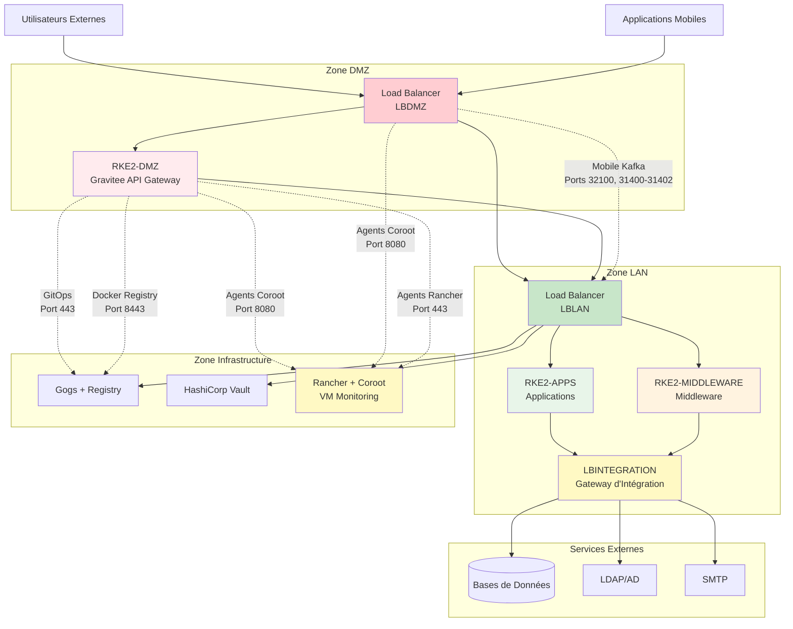

# Matrice de Flux

Ce document détaille les flux de communication principaux entre les différents groupes Ansible, tels que gérés par les load balancers. Comprendre ces flux est essentiel pour configurer les pare-feu, résoudre les problèmes de connectivité et optimiser les performances réseau.

## Vue d'Ensemble des Flux de Trafic



## Matrice de Flux Détaillée

### Flux de Trafic Externe

| Source | Destination | Port Destination | Protocole | Description |
|--------|-------------|-----------------|-----------|-------------|
| **Utilisateur Externe** | `LBDMZ` | 443 | TCP/HTTPS | Trafic applicatif principal des utilisateurs externes, routé vers cluster `RKEAPPS` (contenu statique) ou cluster `RKEDMZ` (APIs) |
| **Application Mobile** | `LBDMZ` | 32100, 31400-31402 | TCP | Trafic applicatif mobile vers brokers Kafka, routé vers cluster `RKEMIDDLEWARE` via `LBLAN` |

### Trafic Utilisateur Interne

| Source | Destination | Port Destination | Protocole | Description |
|--------|-------------|-----------------|-----------|-------------|
| **Utilisateur Interne** | `LBLAN` | 443 | TCP/HTTPS | Trafic applicatif principal (ex: eServices, GCO), routé vers cluster `RKEAPPS` |
| **Utilisateur Admin** | `LBLAN` | 443 | TCP/HTTPS | Accès UI/API middleware (Keycloak, MinIO, n8n, Flowable), routé vers cluster `RKEMIDDLEWARE` |
| **Utilisateur Admin** | `LBLAN` | 443 | TCP/HTTPS | UI gestion Rancher, routé vers groupe `monitoring` (port backend 443) |
| **Utilisateur Admin** | `LBLAN` | 443 | TCP/HTTPS | UI/API serveur Git Gogs, routé vers groupe `gitops` (port backend 443) |
| **Utilisateur Admin** | `LBLAN` | 443 | TCP/HTTPS | Tableau de bord monitoring Coroot, routé vers groupe `monitoring` (port backend 8080) |
| **Utilisateur Admin** | `LBLAN` | 443 | TCP/HTTPS | UI MinIO Backup, routé vers groupe `monitoring` (port backend 9001) |

### Flux GitOps et CI/CD

| Source | Destination | Port Destination | Protocole | Description |
|--------|-------------|-----------------|-----------|-------------|
| **`RKEAPPS` / `RKEMIDDLEWARE`** (ArgoCD) | `LBLAN` | 443 | TCP/HTTPS | Trafic GitOps d'ArgoCD vers Gogs, routé vers groupe `gitops` |
| **`RKEDMZ`** (ArgoCD DMZ) | `gitops` | 443 | TCP/HTTPS | Trafic GitOps: ArgoCD DMZ tirant les configurations depuis Gogs |
| **`RKEDMZ`** | `gitops` | 8443 | TCP/HTTPS | Accès Docker Registry: RKEDMZ tirant les images de conteneurs depuis le registre privé |

### Trafic Cluster DMZ

| Source | Destination | Port Destination | Protocole | Description |
|--------|-------------|-----------------|-----------|-------------|
| **`RKEDMZ`** (Gravitee DMZ) | `LBLAN` | 443 | TCP/HTTPS | Trafic proxy API de Gravitee DMZ vers services backend dans clusters `RKEAPPS` ou `RKEMIDDLEWARE` |
| **`LBDMZ`** | `LBLAN` | 443 | TCP/HTTPS | Routage contenu statique de `LBDMZ` vers `LBLAN` pour livraison vers cluster `RKEAPPS` |
| **`RKEDMZ`** (Gravitee DMZ) | `vault` | 443 | TCP/HTTPS | Récupération secrets: Gravitee DMZ accédant à Vault via LBLAN (443→8200) |

### Flux de Surveillance

| Source | Destination | Port Destination | Protocole | Description |
|--------|-------------|-----------------|----------|-------------|
| **`RKEDMZ`** (Agents Coroot) | `monitoring` | 8080 | TCP | Surveillance: Agents Coroot dans RKE2-DMZ transmettant métriques directement vers serveur Coroot sur VM monitoring |
| **`LBDMZ`** (Agents Coroot) | `monitoring` | 8080 | TCP | Surveillance: Agents Coroot sur LB DMZ transmettant métriques directement vers serveur Coroot sur VM monitoring |

### Connexions Directes (Contourne Load Balancers)

| Source | Destination | Port Destination | Protocole | Description |
|--------|-------------|-----------------|----------|-------------|
| **`RKEAPPS` / `RKEMIDDLEWARE`** | `vault` | 8200 | TCP/HTTPS | **Connexion Directe:** Récupération secrets depuis HashiCorp Vault |
| **`RKEAPPS` / `RKEMIDDLEWARE`** | `monitoring` | 9000 | TCP/S3 | **Connexion Directe:** Longhorn envoyant backups vers endpoint S3 MinIO Backup |

### Flux de Messagerie Kafka

| Source | Destination | Port Destination | Protocole | Description |
|--------|-------------|-----------------|----------|-------------|
| **`RKEAPPS`** | `LBLAN` | 32100 | TCP | Connexion bootstrap Kafka initiale, routée vers cluster `RKEMIDDLEWARE` |
| **`RKEAPPS`** | `LBLAN` | 31400-31402 | TCP | Connexions brokers Kafka, routées vers cluster `RKEMIDDLEWARE` |

### Flux d'Intégration Services Externes

| Source | Destination | Port Destination | Protocole | Description |
|--------|-------------|-----------------|----------|-------------|
| **`RKEAPPS` / `RKEMIDDLEWARE`** | `LBINTEGRATION` | (variable) | TCP | Trafic SMTP vers serveur mail externe |
| **`RKEAPPS` / `RKEMIDDLEWARE`** | `LBINTEGRATION` | (variable) | TCP | Connexion bases de données externes (PostgreSQL, Informix, SIG) |
| **`RKEAPPS` / `RKEMIDDLEWARE`** | `LBINTEGRATION` | (variable) | TCP | Connexion services annuaire LDAP / Active Directory externes |
| **`RKEAPPS`** | `LBINTEGRATION` | (variable) | TCP | Connexion fournisseurs externes (SMS, Paiement) |
| **`RKEAPPS`** | `LBINTEGRATION` | (variable) ou fixe | TCP/HTTPS | Connexion services applicatifs externes (ArcGIS, Alfresco, GMAO, etc.) |

### Flux de Gestion Cluster

| Source | Destination | Port Destination | Protocole | Description |
|--------|-------------|-----------------|----------|-------------|
| **RKEDMZ** (Agents Rancher) | `monitoring` (Rancher) | 443 | TCP/HTTPS | Communication agents Rancher du cluster RKE2-DMZ vers Serveur Rancher |

---

## Catégories de Flux

### 1. Trafic Nord-Sud (Externe ↔ Interne)

**Point d'Entrée:** LBDMZ

**Flux:**

- Utilisateurs externes accédant aux applications web
- Applications mobiles se connectant aux services backend
- Appels API depuis systèmes externes

**Sécurité:**

- Tout trafic inspecté à la frontière DMZ
- Appels API sécurisés par Gravitee API Gateway
- Contenu statique mis en cache au bord

### 2. Trafic Est-Ouest (Interne ↔ Interne)

**Hub:** LBLAN

**Flux:**

- Communication microservice-à-microservice
- Communication application-à-middleware
- Accès administratif aux tableaux de bord

**Sécurité:**

- Segmentation réseau interne
- Authentification service-à-service
- Chiffrement TLS pour données sensibles

### 3. Trafic d'Intégration (Interne → Externe)

**Gateway:** LBINTEGRATION

**Flux:**

- Requêtes base de données vers systèmes externes
- Authentification LDAP/AD
- Livraison email via SMTP
- Intégration SMS et passerelles paiement
- Accès GIS et systèmes de gestion documentaire

**Sécurité:**

- Point de sortie unique pour règles pare-feu
- Gestion des identifiants via Vault
- Regroupement connexions et limitation débit
- Journalisation audit de tous les appels externes

### 4. Trafic de Gestion

**Destinations:** VMs Gitops, Vault, Monitoring

**Flux:**

- Workflows GitOps (Argo CD → Gogs)
- Récupération secrets (Apps → Vault)
- Collecte données surveillance (Agents → Coroot)
- Gestion cluster (Rancher ↔ Clusters)

**Sécurité:**

- Accès administratif restreint
- Injection secrets via Vault Injector
- Canaux communication chiffrés

---

## Référence des Ports

### Ports HTTPS Standards

| Port | Service | Utilisé Par |
|------|---------|-------------|
| **443** | HTTPS | LBDMZ, LBLAN (frontend), Rancher, Gogs, Vault, Keycloak, MinIO UI, Gravitee, Argo CD, etc. |
| **8443** | Docker Registry | LBLAN → Docker Registry |

### Ports Services Backend

| Port | Service | Utilisé Par |
|------|---------|-------------|
| **8200** | HashiCorp Vault | Vault Injector, applications |
| **8080** | Serveur Coroot | Agents Coroot |
| **9000** | API S3 MinIO | Applications, backup Longhorn |
| **9001** | Console MinIO | UI MinIO Backup |

### Ports Kafka

| Port | Service | Utilisé Par |
|------|---------|-------------|
| **32100** | Kafka Bootstrap | Connexion Kafka initiale |
| **31400-31402** | Brokers Kafka | Trafic producer/consumer Kafka |

### Ports Services Externes (via LBINTEGRATION)

| Plage Port | Service | Exemples |
|------------|---------|----------|
| **25, 587, 465** | SMTP | Livraison email |
| **389, 636** | LDAP/LDAPS | Services annuaire |
| **5432** | PostgreSQL | Connexions bases de données |
| **9088** | Informix | Base de données legacy |
| **443** | APIs HTTPS | Paiement, SMS, Services cloud |
| **6443** | ArcGIS | Services GIS |

---

## Guide de Dépannage

### Utilisateurs Externes Ne Peuvent Pas Accéder à l'Application

**Vérifier:**

1. Pare-feu autorise 443 vers LBDMZ
2. LBDMZ route vers LBLAN (contenu statique) ou RKEDMZ (APIs)
3. LBLAN route vers RKEAPPS
4. Pods application en cours d'exécution dans cluster RKEAPPS

### Application Mobile Ne Peut Pas Se Connecter à Kafka

**Vérifier:**

1. Pare-feu autorise 32100, 31400-31402 vers LBDMZ
2. LBDMZ route vers LBLAN
3. LBLAN route vers NodePorts Kafka RKEMIDDLEWARE
4. Brokers Kafka en cours d'exécution et healthy

### ArgoCD Ne Peut Pas Tirer depuis Gogs

**Vérifier:**

1. LBLAN route port 443 vers VM Gitops
2. Service Gogs en cours d'exécution
3. ArgoCD a identifiants Gogs corrects
4. Connectivité réseau entre pods ArgoCD et LBLAN

### Application Ne Peut Pas Récupérer Secrets

**Vérifier:**

1. Service Vault en cours d'exécution
2. Connexion directe depuis cluster vers VM Vault port 8200
3. Vault Injector déployé sur le cluster
4. Compte service a permissions Vault correctes

---

## Configuration Pare-feu

Lors de la configuration des pare-feux, utilisez cette matrice de flux pour créer des règles de sécurité précises. Les tableaux suivants présentent les ports essentiels qui doivent être ouverts entre les zones réseau.

### Communication DMZ vers LAN

Ces ports doivent être ouverts depuis la zone DMZ vers la zone LAN :

| Port(s) | Protocole | Destination | Objectif |
|---------|-----------|-------------|----------|
| **443** | TCP/HTTPS | LBLAN | Routage contenu statique, trafic proxy API, accès administratif |
| **8200** | TCP/HTTPS | Vault | Récupération secrets via transformation port HAProxy (443→8200) |
| **9000** | TCP/S3 | Monitoring (MinIO Backup) | Stockage backups Longhorn |
| **443** | TCP/HTTPS | Gitops | ArgoCD DMZ tirant les configurations depuis Gogs |
| **8443** | TCP/HTTPS | Gitops | Accès Docker Registry pour RKEDMZ tirant les images de conteneurs |
| **8080** | TCP | Monitoring | Agents Coroot transmettant métriques vers serveur Coroot |
| **32100, 31400-31402** | TCP | LBLAN | Trafic mobile Kafka routé vers cluster RKEMIDDLEWARE |

### Communication LAN vers Externe

Ces ports doivent être ouverts depuis la zone LAN vers les services externes :

| Port(s) | Protocole | Destination | Objectif |
|---------|-----------|-------------|----------|
| **5432** | TCP | PostgreSQL externe | Connexions bases de données |
| **9088** | TCP | Informix externe | Connexions bases de données legacy |
| **389, 636** | TCP/LDAP/LDAPS | LDAP/AD externe | Authentification services annuaire |
| **25, 587, 465** | TCP/SMTP | SMTP externe | Livraison email |

### Bonnes Pratiques des Règles Pare-feu

**Règles Pare-feu Zone DMZ:**

```
# Règles entrantes (depuis Internet)
ALLOW TCP 443 → LBDMZ
ALLOW TCP 32100,31400-31402 → LBDMZ

# Règles sortantes (vers LAN)
ALLOW TCP 443 → LBLAN
ALLOW TCP 443 → Gitops
ALLOW TCP 8443 → Gitops
ALLOW TCP 443 → Vault (transformé en 8200 intérieurement)
ALLOW TCP 8080 → Monitoring
ALLOW TCP 32100,31400-31402 → LBLAN

# Interdire tout autre trafic
DENY ALL
```

**Règles Pare-feu Zone LAN:**

```
# Règles entrantes (depuis DMZ)
ALLOW TCP 443,8080 → LBLAN

# Règles sortantes (vers Externe)
ALLOW TCP 5432 → PostgreSQL externe
ALLOW TCP 9088 → Informix externe
ALLOW TCP 389,636 → LDAP/AD externe
ALLOW TCP 25,587,465 → SMTP externe

# Interdire accès Internet direct
DENY ALL FROM Internet
```

**Règles Pare-feu Zone Infrastructure:**

```
# Règles entrantes (depuis LAN)
ALLOW TCP 443 → Gitops, Rancher
ALLOW TCP 8200 → Vault (depuis clusters)
ALLOW TCP 8080 → Coroot (depuis agents)

# Interdire accès Internet direct
DENY ALL FROM Internet
```

### Conseils de Configuration

- **Proxy Load Balancers**: La plupart du trafic inter-zones circule à travers les load balancers (LBLAN, LBDMZ) pour un contrôle et une surveillance centralisés
- **Connexions Directes**: Certains services (Vault, MinIO Backup, Coroot, Gogs) nécessitent une connectivité directe VM-à-VM et ne peuvent pas traverser les load balancers
- **Transformation de Port**: HAProxy sur LBLAN gère la transformation de port pour Vault (443→8200) et d'autres services
- **Surveillance**: Tous les changements de règles pare-feu doivent être journalisés et surveillés pour l'audit de sécurité
- **Test**: Vérifiez la connectivité après application des règles en utilisant des outils comme `telnet`, `nc`, ou des vérifications de santé spécifiques aux applications

---

## Guide de Dépannage
